# Smart Flow - Claude Code 智能任务调度插件 v2.1

[](https://opensource.org/licenses/MIT)
[](https://claude.com/claude-code)
[](https://github.com/XX-Trader/smart-flow)
[](https://github.com/XX-Trader/smart-flow)
[](https://github.com/XX-Trader/smart-flow)

> "先搞清楚要做什么，再找合适的专家同时开工"

**Smart Flow v2.1 全量整合版** - 一个全自动化的开发工作流插件，整合了 **122+ 专业 Agent**、**132+ 技能**、**11+ 斜杠命令**，通过**需求澄清、任务分解、并行执行、结果整合**四大阶段，大幅提升 Claude Code 的开发效率。

## 🎉 v2.1.0 重大更新

### 🚀 核心新功能

#### 1. 智能推荐系统
- ✅ **自动复杂度评估**: 5个维度，100分制评分系统
  - 功能数量、技术栈、集成复杂度、数据复杂度、用户规模
- ✅ **智能 Agent 推荐**: 根据复杂度自动推荐最优组合
  - 简单任务: 2个 Agent，并行数2
  - 中等任务: 5个 Agent，并行数3-4
  - 复杂任务: 8个 Agent，并行数5-7
- ✅ **用户配置界面**: Agent 选择和并行数配置

#### 2. 实时进度跟踪系统
- ✅ **4阶段进度显示**: 需求澄清、任务分解、并行执行、结果综合
- ✅ **整数百分比**: 0-100%，无小数
- ✅ **可视化进度条**: 实时显示每个 Agent 的执行状态
- ✅ **详细进度信息**: 每个阶段的完成百分比和总进度

#### 3. 简化评分系统
- ✅ **功能关键程度评估**: 3个核心维度，100分制
  - 业务价值 (40分)
  - 优先级 (30分)
  - 实现难度 (30分)
- ✅ **快速评估**: 5秒给出评分，拒绝过度复杂

#### 4. Agent 输出模板系统
- ✅ **10个分类模板**: 覆盖所有122个 Agent
- ✅ **结构化输出**: 统一的输出格式，便于 AI 理解
- ✅ **宽松验证**: 提供模板，不强制执行

### 📦 资源来源
- **Smart Flow 核心**: 5 个工作流技能
- **用户自定义**: 50 个实用技能（feature-development、auto-fix、db-deploy 等）
- **Superpowers**: 14 个工作流最佳实践技能
- **官方插件**: 68 个文档处理、设计创意技能

## ✨ 核心特性

### 🎯 拒绝猜测，强制澄清
- ✅ **分批提问**: 每批2-3个问题，避免信息过载
- ✅ **质量评分驱动**: 迭代直到达到90分阈值
- ✅ **结构化需求文档**: JSON 格式，便于后续处理
- ✅ **避免返工**: 确保完全理解用户需求

### ⚡ 智能推荐，并行加速
- ✅ **自动复杂度评估**: 100分制评分系统
- ✅ **智能 Agent 推荐**: 根据需求自动推荐最优组合
- ✅ **用户可配置**: Agent 选择和并行数配置
- ✅ **10x 效率提升**: 同时调用多个专业 Agent

### 📊 实时进度，全程可见
- ✅ **4阶段进度跟踪**: 清晰显示每个阶段的完成情况
- ✅ **整数百分比**: 0-100%，简洁明了
- ✅ **Agent 状态显示**: 实时显示每个 Agent 的执行进度
- ✅ **可视化进度条**: 直观的进度展示

### 🔄 全面覆盖，一站式解决方案
- ✅ **产品经理 (PRD)**: 产品需求文档
- ✅ **UI/UX 设计师**: 界面设计和交互流程
- ✅ **数据库架构师**: 数据模型和表结构
- ✅ **后端架构师**: API 设计和技术架构
- ✅ **前端/后端开发**: 代码实现
- ✅ **测试工程师**: 测试用例和质量保证
- ✅ **安全专家**: 安全审查和漏洞检测
- ✅ **部署工程师**: 部署和运维

### 📋 结构化输出，易于理解
- ✅ **统一输出模板**: 所有 Agent 遵循相同的输出格式
- ✅ **10个分类模板**: 产品设计、架构后端、前端、数据AI、运维部署、测试质量、编程语言、研究分析、移动开发、其他领域
- ✅ **JSON + Markdown**: 机器可读 + 人类可读

## 🚀 快速开始

### 安装

#### 方法 1: 通过市场安装（推荐）

```bash
# 1. 注册市场
/plugin marketplace add XX-Trader/smart-flow-marketplace

# 2. 安装插件
/plugin install smart-flow@smart-flow-marketplace

# 3. 验证安装
/help
# 应该看到 /smart-flow 和 /sf 命令
```

#### 方法 2: 手动克隆安装

```bash
# 1. 克隆插件
cd ~/.claude/plugins
git clone https://github.com/XX-Trader/smart-flow.git

# 2. 配置 Claude Code
# 在 ~/.claude/CLAUDE.md 中添加:
# ## Smart Flow
# When user wants to build a feature, use smart-flow skills.
```

详细安装指南请参考 [市场安装指南](MARKET_INSTALL.md) 或 [完整安装文档](INSTALL.md)

### 使用

#### 自动触发
```
你: 帮我做一个用户登录功能

Smart Flow: 检测到模糊需求，启动需求澄清流程...
```

#### 手动触发
```
你: /smart-flow

Smart Flow: 启动智能任务调度流程...
```

## 📖 工作流程

```mermaid
graph LR
    A[用户输入需求] --> B[需求澄清]
    B --> C[任务分解 + 智能推荐]
    C --> D[用户确认配置]
    D --> E[并行执行 + 实时进度]
    E --> F[结果整合]
    F --> G[完整报告]
```



### 阶段 1: 需求澄清 (Requirements Clarity) - 20%
系统性提问，澄清所有模糊点
- **分批提问**: 每批2-3个问题
- **质量评分**: 迭代直到≥90分
- **自适应提问**: 针对得分最低的维度提问
- **示例问题**:
  - 功能目标是什么？
  - 目标用户是谁？
  - 核心功能有哪些？
  - 技术栈偏好？
  - 约束条件？

### 阶段 2: 任务分解 + 智能推荐 (Task Decomposer) - 30%
自动识别专业领域，生成任务清单，推荐 Agent 组合
- **复杂度评估**: 5个维度，100分制
- **Agent 推荐**: 根据复杂度推荐最优组合
- **用户配置界面**: Agent 选择和并行数配置
- **用户确认**: 使用 AskUserQuestion 确认配置

### 阶段 3: 并行执行 + 实时进度 (Parallel Executor) - 40%
同时启动多个专业 Agent，实时显示进度
- **执行前确认**: 显示配置摘要和 Agent 列表
- **并行调度**: 根据用户配置的并行数分批执行
- **实时进度**: 更新阶段进度和总进度
- **错误处理**: Agent 失败时询问用户处理方式
- **进度显示**:
  ```
  Phase 3: 并行执行  ████████░░░░░░░░░░░░░  60% 🔄
  总进度:  ███████████████░░░░░░░░  68%

  🔄 Agent 执行中:
    ✅ product-manager (100%) - 12分钟
    🔄 backend-architect (50%) - 预计8分钟
    🔄 frontend-developer (30%) - 预计15分钟
  ```

### 阶段 4: 结果整合 (Result Synthesizer) - 10%
汇总所有输出，生成完整报告
- 需求维度 (PRD)
- 设计维度 (UI/UX)
- 架构维度 (DB/API)
- 代码维度 (Frontend/Backend)
- 质量维度 (Test/Security)

## 🎭 支持的专业 Agent (122+)

### 产品与设计 (8个)
- `product-manager` - 产品经理
- `ui-ux-designer` - UI/UX 设计师
- `architect-review` - 架构审查
- `documentation-architect` - 文档架构师
- `api-documenter` - API 文档工程师
- `impact-analyzer-frontend` - 前端需求分析
- `impact-analyzer-backend` - 后端需求分析
- `impact-analyzer-strategy` - 策略需求分析

### 架构与后端 (15个)
- `backend-architect` - 后端架构师
- `database-architect` - 数据库架构师
- `backend-developer` - 后端开发
- `php-developer` - PHP 开发
- `ruby-expert` - Ruby 专家
- `rails-expert` - Rails 专家
- `graphql-architect` - GraphQL 架构师
- `database-optimizer` - 数据库优化
- `database-optimization` - 数据库性能调优
- `database-admin` - 数据库管理员
- `sql-expert` - SQL 专家
- `laravel-vue-developer` - Laravel+Vue 全栈
- `directus-developer` - Directus 开发
- `drupal-developer` - Drupal 开发
- `wordpress-developer` - WordPress 开发

### 前端开发 (12个)
- `frontend-developer` - 前端开发
- `react-performance-optimization` - React 性能优化
- `smart-flow:core:frontend-developer` - SmartFlow 前端开发
- `typescript-expert` - TypeScript 专家
- `javascript-developer` - JavaScript 开发
- `nextjs-app-router-developer` - Next.js App Router 专家

### 数据与AI (10个)
- `ai-engineer` - AI 工程师
- `data-engineer` - 数据工程师
- `ml-engineer` - 机器学习工程师
- `mlops-engineer` - MLOps 工程师
- `data-scientist` - 数据科学家
- `data-analyst` - 数据分析师
- `prompt-engineer` - Prompt 优化专家
- `python-expert` - Python 专家（数据科学）
- `quant-analyst` - 量化分析师
- `academic-research-synthesizer` - 学术研究综合

### 运维与部署 (10个)
- `deployment-engineer` - 部署工程师
- `devops-troubleshooter` - DevOps 故障排查
- `cloud-architect` - 云架构师
- `github-actions-runner` - GitHub Actions 专家
- `terraform-specialist` - Terraform 专家
- `incident-responder` - 生产事故处理
- `db-deploy` - 数据库部署
- `windows-fullstack-deploy` - Windows 全栈部署
- `mcp-deployment-orchestrator` - MCP 部署编排
- `deployment-test` - 部署测试

### 测试与质量 (8个)
- `test-automator` - 测试自动化
- `code-reviewer` - 代码审查
- `security-auditor` - 安全审计
- `api-security-audit` - API 安全审计
- `test-driven-development` - TDD
- `verification-before-completion` - 完成前验证
- `debugger` - 调试专家
- `error-detective` - 错误侦探

### 编程语言专项 (11个)
- `python-expert` - Python 专家
- `golang-expert` - Go 专家
- `java-developer` - Java 开发
- `cpp-engineer` - C++ 工程师
- `rust-expert` - Rust 专家
- `c-developer` - C 语言专家
- `typescript-expert` - TypeScript 专家
- `javascript-developer` - JavaScript 开发

### 研究与分析 (10个)
- `research-orchestrator` - 研究协调器
- `comprehensive-researcher` - 综合研究员
- `technical-researcher` - 技术研究员
- `academic-researcher` - 学术研究员
- `market-research-analyst` - 市场研究分析师
- `search-specialist` - 搜索专家
- `query-clarifier` - 查询澄清
- `research-coordinator` - 研究协调器
- `research-synthesizer` - 研究综合
- `report-generator` - 报告生成器

### 移动开发 (8个)
- `mobile-developer` - 移动开发
- `ios-developer` - iOS 开发

### 其他领域 (30+)
- **网络与性能**: network-engineer, performance-engineer
- **区块链与加密货币**: blockchain-developer, crypto-trader, arbitrage-bot, crypto-analyst, crypto-risk-manager, defi-strategist
- **MCP相关**: mcp-expert, mcp-server-architect, mcp-security-auditor, mcp-testing-engineer
- **开发工具**: command-expert, dx-optimizer, legacy-modernizer
- **内容与媒体**: content-manager, podcast-transcriber, podcast-metadata-specialist, social-media-copywriter, social-media-clip-creator
- **文本处理与OCR**: ocr-quality-assurance, ocr-grammar-fixer, timestamp-precision-specialist, text-comparison-validator, visual-analysis-ocr
- **其他专业**: agent-expert, task-decomposition-expert

完整列表请参阅 [AGENT_LIST.md](docs/AGENT_LIST.md) 或 [CATEGORY_INDEX.md](templates/agent-outputs/CATEGORY_INDEX.md)

## 📚 文档

### 核心文档
- [INSTALL.md](INSTALL.md) - 安装指南
- [ARCHITECTURE.md](docs/ARCHITECTURE.md) - 架构设计
- [AGENT_LIST.md](docs/AGENT_LIST.md) - Agent 列表
- [CUSTOMIZATION.md](docs/CUSTOMIZATION.md) - 自定义指南
- [SMART_FLOW_V2.1_PLAN.md](SMART_FLOW_V2.1_PLAN.md) - v2.1.0 实施计划

### 工具文档
- [utils/quality-scorer.md](utils/quality-scorer.md) - 需求关键程度评分系统
- [utils/progress-tracker.md](utils/progress-tracker.md) - 开发进度跟踪系统
- [utils/smart-recommender.md](utils/smart-recommender.md) - 智能推荐系统

### 模板文档
- [templates/agent-outputs/CATEGORY_INDEX.md](templates/agent-outputs/CATEGORY_INDEX.md) - Agent 输出模板索引
- 10个分类模板，覆盖所有122个 Agent

## 💡 使用示例

### 示例 1: 开发用户登录功能（简单任务）

```
你: /smart-flow
我想做一个用户登录功能，支持邮箱和手机号登录

Smart Flow:
[阶段 1: 需求澄清 - 20%]
当前评分: 15/100 ❌
Q1: 登录功能的目标是什么?
   A. 网站用户登录
   B. 管理后台登录
   C. 两者都需要

你: A

Smart Flow:
当前评分: 45/100 ⚠️
Q2: 目标用户是谁?
   A. 普通网站访客
   B. 内部管理员
   C. 两者都有

你: A

... (继续提问直到≥90分)

[阶段 2: 任务分解 + 智能推荐 - 30%]
✅ 复杂度评估: 35/100 (简单任务)
✅ 推荐 Agent: 2个
   - product-manager
   - frontend-developer
✅ 推荐并行数: 2个

你: 确认

[阶段 3: 并行执行 + 实时进度 - 40%]
Phase 3: 并行执行  ████████░░░░░░░░░░░░░  60% 🔄
总进度:  ████████████░░░░░░░░░░░░  74%

🔄 Agent 执行中:
  ✅ product-manager (100%) - 10分钟
  🔄 frontend-developer (50%) - 预计15分钟

[阶段 4: 结果整合 - 10%]
✅ 完整报告已生成!
```

### 示例 2: 开发电商网站（复杂任务）

```
你: 帮我做一个电商网站

Smart Flow: 检测到模糊需求，启动需求澄清...
[系统性提问，澄清所有细节]
当前评分: 92/100 ✅

[阶段 2: 任务分解 + 智能推荐]
✅ 复杂度评估: 78/100 (复杂任务)
✅ 推荐 Agent: 8个
   批次1 (并行):
     - product-manager
     - ui-ux-designer
     - database-architect
     - architect-review
   批次2 (并行):
     - backend-architect
     - frontend-developer
     - backend-developer
     - api-documenter
   批次3 (并行):
     - test-automator
     - security-auditor
     - performance-engineer
     - code-reviewer
✅ 推荐并行数: 5个

你: 确认

[阶段 3: 并行执行 + 实时进度]
Phase 3: 并行执行  ████████████░░░░░░░░░  80% 🔄
总进度:  ████████████████░░░░░░░  88%

🔄 Agent 执行中:
  批次1 (已完成):
    ✅ product-manager (100%) - 15分钟
    ✅ ui-ux-designer (100%) - 20分钟
    ✅ database-architect (100%) - 15分钟
    ✅ architect-review (100%) - 10分钟

  批次2 (进行中):
    ✅ backend-architect (100%) - 20分钟
    🔄 frontend-developer (60%) - 预计30分钟
    🔄 backend-developer (50%) - 预计25分钟
    🔄 api-documenter (40%) - 预计15分钟

[阶段 4: 结果整合]
✅ 完整报告已生成!
```

## 🔧 高级特性

### 1. 智能推荐系统
- **自动复杂度评估**: 5个维度，100分制
- **Agent 推荐**: 根据复杂度自动推荐最优组合
- **用户配置界面**: Agent 选择和并行数配置
- **灵活调整**: 用户可以增减 Agent 和调整并行数

### 2. 实时进度跟踪
- **4阶段进度显示**: 清晰显示每个阶段的完成情况
- **整数百分比**: 0-100%，无小数
- **Agent 状态显示**: 实时显示每个 Agent 的执行进度
- **可视化进度条**: 直观的进度展示

### 3. 增量执行和断点续传
- **保存执行状态**: 每个批次完成后保存状态
- **重启时继续**: 仅执行失败或未完成的任务
- **检查点机制**: 支持从任意检查点恢复

### 4. 历史记录和版本管理
- **唯一执行 ID**: 每次执行生成唯一 ID
- **完整历史**: 保存需求、任务、结果
- **版本对比**: 支持基于历史记录创建新任务

### 5. 自定义 Agent 配置
- **Agent 选择**: 用户可以选择使用哪些 Agent
- **并行数配置**: 用户可以调整同时运行的 Agent 数量
- **灵活配置**: 支持跳过某些 Agent 或添加额外的 Agent

## 🆕 v2.1.0 vs v2.0.0

| 功能 | v2.0.0 | v2.1.0 |
|------|--------|--------|
| 需求评分 | 复杂的15维度系统 | 简化的3维度系统 |
| 进度跟踪 | ❌ 无 | ✅ 4阶段进度，整数百分比 |
| 智能推荐 | ❌ 无 | ✅ 复杂度评估 + Agent 推荐 |
| 用户配置 | ❌ 固定配置 | ✅ Agent 选择 + 并行数配置 |
| Agent 模板 | ❌ 无 | ✅ 10个分类模板 |
| 实时进度 | 基础显示 | 详细 Agent 状态 + 进度条 |

## 🛠️ 开发路线图

### v2.1.0 (当前版本) - 2026-01-07 ✅
- ✅ 智能推荐系统
- ✅ 实时进度跟踪
- ✅ 简化评分系统
- ✅ Agent 输出模板系统
- ✅ 用户配置界面

### v2.2.0 (计划中)
- ⏳ Web Dashboard 可视化界面
- ⏳ 更多 Agent 输出模板
- ⏳ 自动化测试集成
- ⏳ 性能优化

### v3.0.0 (未来版本)
- ⏳ 多用户协作
- ⏳ 云端同步
- ⏳ AI 自学习和优化
- ⏳ 插件市场集成

## 📄 License

MIT License - 详见 [LICENSE](LICENSE)

## 🙏 致谢

- [Superpowers](https://github.com/obra/superpowers) - 灵感来源
- [Claude Code](https://claude.com/claude-code) - 强大的 AI 开发工具

## 📮 联系我们

- GitHub Issues: [smart-flow/issues](https://github.com/XX-Trader/smart-flow/issues)

---

**让 AI 成为你的项目经理，而不是猜测者** 🚀
