# Smart Flow - Claude Code 智能任务调度插件

[](https://opensource.org/licenses/MIT)
[](https://claude.com/claude-code)

> "先搞清楚要做什么，再找合适的专家同时开工"

Smart Flow 是一个全自动化的开发工作流插件，通过**需求澄清、任务分解、并行执行、结果整合**四大阶段，大幅提升 Claude Code 的开发效率。

## ✨ 核心特性

### 🎯 拒绝猜测
强制需求澄清，不再让 AI "自作聪明"
- 系统性提问，确保完全理解用户需求
- 结构化需求文档（JSON 格式）
- 避免返工和误解

### ⚡ 并行加速
同时调用多个专业 Agent，10x 提升效率
- 支持 40+ 专业 Agent
- 智能依赖关系识别
- 自动并行调度

### 🔄 全面覆盖
一站式解决方案
- 产品经理 (PRD)
- UI/UX 设计师
- 数据库架构师
- 后端架构师
- 前端/后端开发
- 测试工程师
- 安全专家
- ... 更多专业领域

### 📊 智能整合
自动生成完整报告
- 需求文档
- 设计方案
- 技术架构
- 实现代码
- 测试用例
- 安全审查

## 🚀 快速开始

### 安装

```bash
# 1. 克隆插件
cd ~/.claude/plugins
git clone https://github.com/YOUR-USERNAME/smart-flow.git

# 2. 配置 Claude Code
# 在 ~/.claude/CLAUDE.md 中添加:
# ## Smart Flow
# When user wants to build a feature, use smart-flow skills.
```

### 使用

#### 自动触发
```
你: 帮我做一个用户登录功能

Smart Flow: 检测到模糊需求，启动需求澄清流程...
```

#### 手动触发
```
你: /smart-flow

Smart Flow: 启动智能任务调度流程...
```

## 📖 工作流程

```mermaid
graph LR
    A[用户输入需求] --> B[需求澄清]
    B --> C[任务分解]
    C --> D[并行执行]
    D --> E[结果整合]
    E --> F[完整报告]
```



### 阶段 1: 需求澄清 (Requirements Clarity)
系统性提问，澄清所有模糊点
- 功能目标是什么？
- 目标用户是谁？
- 核心功能有哪些？
- 技术栈偏好？
- 约束条件？
- 参考资料？

### 阶段 2: 任务分解 (Task Decomposer)
自动识别专业领域，生成任务清单
- 智能关键词匹配
- 依赖关系识别
- 优先级排序
- 并行阶段划分

### 阶段 3: 并行执行 (Parallel Executor)
同时启动多个专业 Agent
- 无依赖任务并行执行
- 实时进度追踪
- 错误处理和重试
- 断点续传

### 阶段 4: 结果整合 (Result Synthesizer)
汇总所有输出，生成完整报告
- 需求维度 (PRD)
- 设计维度 (UI/UX)
- 架构维度 (DB/API)
- 代码维度 (Frontend/Backend)
- 质量维度 (Test/Security)

## 🎭 支持的专业 Agent (40+)

### 核心开发 (8个)
- `product-manager` - 产品经理
- `ui-ux-designer` - UI/UX 设计师
- `database-architect` - 数据库架构师
- `backend-architect` - 后端架构师
- `frontend-developer` - 前端开发
- `backend-developer` - 后端开发
- `test-automator` - 测试工程师
- `security-auditor` - 安全专家

### API & 文档 (3个)
- `api-documenter` - API 文档工程师
- `documentation-architect` - 技术文档架构师
- `graphql-architect` - GraphQL 架构师

### 数据库 (4个)
- `database-optimizer` - 数据库优化专家
- `database-optimization` - 数据库性能调优
- `database-admin` - 数据库管理员
- `sql-expert` - SQL 专家

### 部署 & 运维 (8个)
- `deployment-engineer` - 部署工程师
- `devops-troubleshooter` - DevOps 故障排查
- `cloud-architect` - 云架构师
- `windows-fullstack-deploy` - Windows 全栈部署
- `db-deploy` - 数据库部署专家
- `github-actions-runner` - GitHub Actions 专家
- `terraform-specialist` - Terraform 专家
- `incident-responder` - 生产事故处理

### 编程语言专项 (11个)
- `python-expert` - Python 专家
- `typescript-expert` - TypeScript 专家
- `javascript-developer` - JavaScript 开发
- `golang-expert` - Go 专家
- `java-developer` - Java 开发
- `cpp-engineer` - C++ 工程师
- `rust-expert` - Rust 专家
- `c-developer` - C 语言专家
- `php-developer` - PHP 开发
- `ruby-expert` - Ruby 专家
- `sql-expert` - SQL 专家

### AI & 数据 (7个)
- `ai-engineer` - AI 工程师
- `prompt-engineer` - Prompt 优化专家
- `data-engineer` - 数据工程师
- `ml-engineer` - 机器学习工程师
- `mlops-engineer` - MLOps 工程师
- `data-scientist` - 数据科学家
- `data-analyst` - 数据分析师

### 研究 & 分析 (6个)
- `research-orchestrator` - 研究协调器
- `comprehensive-researcher` - 综合研究员
- `technical-researcher` - 技术研究员
- `academic-researcher` - 学术研究员
- `market-research-analyst` - 市场研究分析师
- `search-specialist` - 搜索专家

### 其他领域 (15+)
- `network-engineer` - 网络工程师
- `debugger` - 调试专家
- `performance-engineer` - 性能工程师
- `code-reviewer` - 代码审查工程师
- `mobile-developer` - 移动开发
- `blockchain-developer` - 区块链开发
- ... 更多专业领域

完整列表请参阅 [AGENT_LIST.md](docs/AGENT_LIST.md)

## 📚 文档

- [INSTALL.md](INSTALL.md) - 安装指南
- [ARCHITECTURE.md](docs/ARCHITECTURE.md) - 架构设计
- [AGENT_LIST.md](docs/AGENT_LIST.md) - Agent 列表
- [CUSTOMIZATION.md](docs/CUSTOMIZATION.md) - 自定义指南

## 💡 使用示例

### 示例 1: 开发用户登录功能

```
你: /smart-flow
我想做一个用户登录功能，支持邮箱和手机号登录

Smart Flow:
[阶段 1: 需求澄清]
Q1: 登录功能的目标用户是谁?
A: 网站注册用户
Q2: 需要支持第三方登录吗(微信/GitHub)?
A: 暂时不需要
...

[阶段 2: 任务分解]
✅ 已识别 8 个任务，分为 3 个并行阶段

[阶段 3: 并行执行]
⏳ 正在执行 7 个 agent...

[阶段 4: 结果整合]
✅ 完整报告已生成!
```

### 示例 2: 开发电商网站

```
你: 帮我做一个电商网站

Smart Flow: 检测到模糊需求，启动需求澄清...
[系统性提问，澄清所有细节]
[自动识别 15+ 个专业领域]
[并行执行，大幅提升效率]
[生成完整报告]
```

## 🔧 高级特性

### 增量执行和断点续传
- 保存执行状态
- 重启时继续未完成的任务
- 仅执行失败或未完成的任务

### 历史记录和版本管理
- 每次执行生成唯一 ID
- 保存完整的需求、任务、结果
- 支持基于历史记录创建新任务

### 进度可视化
实时显示执行进度：
```
⏳ Smart Flow 执行进度
✅ 阶段 1: 需求澄清 (100%)
⏳ 阶段 2: 任务分解 (60%)
...
```

### 自定义 Agent 配置
允许用户添加/修改 Agent 配置

## 🤝 与 Superpowers 的关系

Smart Flow 可以**复用 Superpowers 的技能**：
- `brainstorming` → 需求澄清
- `writing-plans` → 任务分解
- `dispatching-parallel-agents` → 并行执行
- `requesting-code-review` → 结果整合

**核心区别**：
- **Superpowers**: 手动调用技能 (`/superpowers:brainstorm`)
- **Smart Flow**: 自动触发完整工作流，一次性完成

## 🛠️ 开发路线图

### v0.1.0 (MVP) - 2025-01-07
- ✅ 需求澄清技能
- ✅ 任务分解技能 (5 个核心 agent)
- ✅ 并行执行技能 (2 个阶段)
- ✅ 结果整合技能

### v0.5.0 (标准版) - 计划中
- ⏳ 支持 8 个核心 agent
- ⏳ 自动触发机制
- ⏳ 依赖关系识别
- ⏳ 进度追踪

### v1.0.0 (完整版) - 计划中
- ⏳ 支持 40+ agent
- ⏳ 增量执行和断点续传
- ⏳ 自定义 agent 配置
- ⏳ 进度可视化
- ⏳ 依赖关系可视化

## 📄 License

MIT License - 详见 [LICENSE](LICENSE)

## 🙏 致谢

- [Superpowers](https://github.com/obra/superpowers) - 灵感来源
- [Claude Code](https://claude.com/claude-code) - 强大的 AI 开发工具

## 📮 联系我们

- GitHub Issues: [smart-flow/issues](https://github.com/YOUR-USERNAME/smart-flow/issues)
- Email: your-email@example.com

---

**让 AI 成为你的项目经理，而不是猜测者** 🚀
