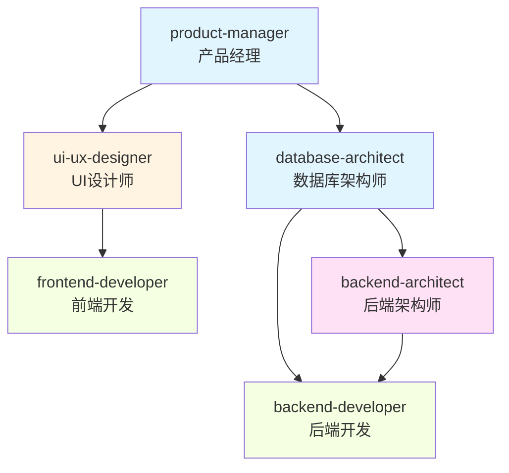

# Parallel Executor - 并行执行引擎

## 概述

**核心原则**: 同时启动多个专业 agent，最大化并行效率，实时显示进度

基于任务分解结果和用户确认的配置，智能调度多个 agent 并行工作，实时追踪进度，处理错误和重试。

---

## 📊 输入

来自 `task-decomposer` 的任务清单（JSON 格式）

**包含**:
- 任务列表和依赖关系
- 用户选择的 Agent 组合
- 用户配置的并行数量

---

## 🎯 进度跟踪集成

### 进度显示

**参考**: `utils/progress-tracker.md`

```markdown
## Smart Flow 工作流进度

Phase 1: 需求澄清     ████████████░░░░░░░░░░ 100% ✅
Phase 2: 任务分解     ████████████░░░░░░░░░░ 100% ✅
Phase 3: 并行执行     ████████░░░░░░░░░░░░░░  60% 🔄
Phase 4: 结果综合     ░░░░░░░░░░░░░░░░░░░░░░   0%
────────────────────────────────────────────
总进度: ███████████████░░░░░░░░  68%

🔄 Agent 执行中:
  ✅ product-manager (100%) - 12分钟
     ✅ 已生成 PRD 文档
  ✅ ui-ux-designer (100%) - 15分钟
     ✅ 已完成 UI 设计稿
  ✅ database-architect (100%) - 10分钟
     ✅ 已完成数据库 schema
  🔄 backend-architect (50%) - 预计8分钟
     🔄 正在设计 API...
  🔄 frontend-developer (30%) - 预计15分钟
     🔄 正在实现登录页面...
```

---

## 🚀 执行流程

### Step 1: 确认执行配置

显示用户确认界面：

```markdown
## Smart Flow 执行确认

### 配置摘要
- **Agent 数量**: 6个
- **并行数量**: 3个
- **执行阶段**: 2个
- **预计耗时**: 50分钟

### Agent 列表

批次 1 (3个并行):
  1. product-manager (产品经理) - 12分钟
  2. ui-ux-designer (UI/UX 设计师) - 15分钟
  3. database-architect (数据库架构师) - 10分钟

批次 2 (3个并行，依赖批次1):
  4. backend-architect (后端架构师) - 15分钟
  5. frontend-developer (前端开发) - 25分钟
  6. backend-developer (后端开发) - 20分钟

### 准备启动

确认开始执行?
  [1. 确认启动  2. 调整配置  3. 取消]
```

### Step 2: 启动并行执行

```python
for stage in execution_plan.stages:
    # 显示阶段开始
    display_stage_start(stage)

    # 获取该阶段的所有任务
    tasks = stage.tasks

    # 分批并行执行（根据用户配置的并行数）
    for batch in create_batches(tasks, parallel_count):
        # 并行启动该批次的所有 agent
        for task in batch:
            task_id = dispatch_agent(task)
            monitor_progress(task_id)

        # 等待该批次完成
        wait_for_batch_completion(batch)

        # 更新进度
        update_progress(stage, batch)
```

### Step 3: 实时进度更新

**每个 Agent 状态变化时立即更新**：

```python
def on_agent_progress(agent_id, progress_percent):
    # 更新该 Agent 的进度
    update_agent_progress(agent_id, progress_percent)

    # 更新阶段进度
    stage_progress = calculate_stage_progress()
    update_stage_progress(stage_progress)

    # 更新总进度
    total_progress = calculate_total_progress()
    update_total_progress(total_progress)

    # 显示进度
    display_progress()
```

---

## 📋 执行策略

### 并行阶段执行

```python
# 伪代码
for stage in execution_plan.stages:
    if stage.can_run_in_parallel:
        # 根据用户配置的并行数分批
        batch_size = user_config.parallel_count

        for batch in split_into_batches(stage.tasks, batch_size):
            # 同时启动该批次的所有任务
            for task in batch:
                task_id = dispatch_agent(task, run_in_background=True)

            # 等待该批次所有任务完成
            wait_for_all_tasks(task_id)

            # 检查是否有失败
            if any_failed(batch):
                handle_failures(batch)

            # 更新进度
            update_stage_progress(stage.name, 100%)
    else:
        # 串行执行
        for task in stage.tasks:
            dispatch_agent(task)
            wait_for_completion()
            update_progress(task.name, 100%)
```

### 任务调度算法

```
1. 识别当前可执行的任务（无依赖或依赖已完成）
2. 根据用户配置的并行数分批
3. 同时启动每批的所有任务（使用 Task tool 的 run_in_background 参数）
4. 实时监控每个任务的状态
5. 任务完成后，检查是否有新任务可执行
6. 重复直到所有任务完成
```

---

## 🔧 Agent 调用方式

### 使用 Task Tool

```typescript
// 并行启动多个 agent（后台运行）
Task({
  subagent_type: "product-manager",
  prompt: "根据以下需求编写产品需求文档...",
  description: "编写 PRD",
  run_in_background: true  // 关键：后台运行
})

Task({
  subagent_type: "ui-ux-designer",
  prompt: "根据以下需求设计 UI 界面...",
  description: "UI 设计",
  run_in_background: true  // 关键：后台运行
})

Task({
  subagent_type: "database-architect",
  prompt: "根据以下需求设计数据库架构...",
  description: "数据库设计",
  run_in_background: true  // 关键：后台运行
})

// 等待所有后台任务完成
waitForAllBackgroundTasks()
```

### 获取 Agent 输出

```typescript
// 获取后台任务结果
const result1 = await TaskOutput({
  task_id: "task-xxx-1",
  block: true,
  timeout: 300000  // 5 分钟超时
})

const result2 = await TaskOutput({
  task_id: "task-xxx-2",
  block: true,
  timeout: 300000
})

const result3 = await TaskOutput({
  task_id: "task-xxx-3",
  block: true,
  timeout: 300000
})
```

---

## ⚠️ 错误处理

### Agent 失败处理

```python
if agent_failed(task):
    # 记录错误
    log_error(task.error)

    # 使用 AskUserQuestion 询问用户
    user_choice = ask_user(
        f"⚠️ Agent {task.agent} 执行失败\n\n"
        f"错误: {task.error}\n\n"
        "如何处理?",
        options=[
            "重试该任务",
            "跳过该任务，继续其他任务",
            "终止整个流程"
        ]
    )

    if user_choice == "重试该任务":
        retry_task(task)
    elif user_choice == "跳过该任务":
        mark_task_skipped(task)
        warn_dependent_tasks(task)
    else:  # 终止
        terminate_execution()
```

### 部分失败继续执行

```
⚠️ Agent backend-architect 执行失败

错误: 无法连接到数据库

如何处理?
1. 重试该任务
2. 跳过该任务，继续其他任务
3. 终止整个流程

用户选择: 2

✅ 已跳过 backend-architect
⚠️ 注意: 依赖该任务的任务 (backend-developer) 可能无法正常执行
⏳ 继续执行其他任务...
```

---

## 💾 断点续传

### 保存执行状态

```json
{
  "checkpoint": "parallel_executor_stage_2_batch_1",
  "can_resume": true,
  "resume_command": "/smart-flow resume EXEC-2025-01-07-001",

  "progress": {
    "phase1": 100,
    "phase2": 40,
    "phase3": 0,
    "phase4": 0,
    "total": 68
  }
}
```

### 恢复执行

```
用户: /smart-flow resume

Smart Flow: 检测到未完成的执行:

执行 ID: EXEC-2025-01-07-001
开始时间: 2025-01-07 14:30
状态: 阶段 3 批次 1 (40%)
已完成: 3/6 任务
剩余任务: 3 个

是否继续?
[1. 继续 2. 重新开始 3. 查看详情]

用户: 1

✅ 继续执行...
```

---

## ⚙️ 性能优化

### 并发控制

```python
# 用户配置的并行数
MAX_CONCURRENT_AGENTS = user_config.parallel_count

running_tasks = []
for task in pending_tasks:
    if len(running_tasks) < MAX_CONCURRENT_AGENTS:
        task_id = dispatch_agent(task, run_in_background=True)
        running_tasks.append(task_id)
    else:
        wait_for_any_completion(running_tasks)
        remove_completed(running_tasks)
```

### 资源管理

- **内存限制**: 监控内存使用，必要时暂停新任务
- **Token 管理**: 预估每个任务的 token 消耗
- **超时控制**: 设置每个任务的最大执行时间（默认30分钟）

---

## ✅ 完成检查

### 所有任务完成

```markdown
✅ 所有任务已完成!

### 执行摘要

- **总任务数**: 6
- **成功**: 6
- **失败**: 0
- **跳过**: 0
- **总耗时**: 47分钟

### 任务详情

✅ product-manager - 12分钟
   📄 输出: docs/prd.md

✅ ui-ux-designer - 15分钟
   📄 输出: docs/ui-design.md

✅ database-architect - 10分钟
   📄 输出: docs/database-schema.sql

✅ backend-architect - 14分钟
   📄 输出: docs/api-design.md

✅ frontend-developer - 26分钟
   📄 输出: src/frontend/

✅ backend-developer - 20分钟
   📄 输出: src/backend/

### 进度更新

Phase 3: 并行执行  ████████████░░░░░░░░░░ 100% ✅

下一步: 生成综合报告...
```

---

## ✅ 验证检查清单

并行执行完成后：
- [ ] 所有任务都已执行（成功/跳过）
- [ ] 收集所有 agent 的输出
- [ ] 生成执行摘要
- [ ] 更新进度：Phase 3 完成 (100%)
- [ ] 保存执行历史
- [ ] 进入下一阶段：结果整合

---

## 🔄 后续步骤

并行执行完成后：
1. 收集所有 agent 输出
2. 生成执行摘要
3. 更新进度：Phase 3 完成 (100%)
4. 进入下一阶段：结果整合 (`smart-flow:result-synthesizer`)

---

## 🔄 批次依赖关系详解

### 依赖关系类型

在并行执行中，任务之间的依赖关系决定了执行顺序：

#### 1. 无依赖任务（可并行）

```yaml
任务A: product-manager
任务B: ui-ux-designer
任务C: database-architect

依赖关系: 无
执行方式: 可同时并行执行
批次: 批次 1
```

**执行顺序**：
```
[批次1] 同时启动
  ├─ product-manager (12分钟)
  ├─ ui-ux-designer (15分钟)
  └─ database-architect (10分钟)

等待所有完成 → 耗时: max(12, 15, 10) = 15分钟
```

#### 2. 简单依赖（串行）

```yaml
任务A: product-manager
任务B: ui-ux-designer
  依赖: [A] - 需要PRD文档才能设计UI
任务C: frontend-developer
  依赖: [B] - 需要UI设计稿才能实现

执行方式: 串行执行
批次: 3个独立批次
```

**执行顺序**：
```
[批次1] product-manager (12分钟)
  ↓ 完成
[批次2] ui-ux-designer (15分钟)
  ↓ 完成
[批次3] frontend-developer (25分钟)

总耗时: 12 + 15 + 25 = 52分钟
```

#### 3. 混合依赖（部分并行）

```yaml
任务A: product-manager (无依赖)
任务B: ui-ux-designer (无依赖)
任务C: database-architect (无依赖)
任务D: backend-architect (依赖: C)
任务E: frontend-developer (依赖: B)
任务F: backend-developer (依赖: C, D)

执行方式: 批次1并行，批次2并行（依赖批次1）
```

**执行顺序**：
```
[批次1] 同时启动
  ├─ product-manager (12分钟) → PRD文档
  ├─ ui-ux-designer (15分钟) → UI设计稿
  └─ database-architect (10分钟) → 数据库schema

等待所有完成 → 耗时: 15分钟

[批次2] 同时启动（依赖批次1的输出）
  ├─ backend-architect (依赖: schema) → API设计 (14分钟)
  ├─ frontend-developer (依赖: UI设计稿) → 前端实现 (26分钟)
  └─ backend-developer (依赖: schema, API设计) → 后端实现 (20分钟)

等待所有完成 → 耗时: 26分钟

总耗时: 15 + 26 = 41分钟（比串行52分钟快21%）
```

---

### 依赖识别规则

#### 自动识别依赖

```python
def identify_dependencies(tasks):
    """
    根据任务类型和输出自动识别依赖关系
    """
    dependencies = {}

    # 规则1: 设计类任务依赖产品经理
    design_tasks = ['ui-ux-designer', 'database-architect']
    for task in design_tasks:
        if 'product-manager' in tasks:
            dependencies[task] = ['product-manager']

    # 规则2: 开发任务依赖设计类任务
    dev_tasks = {
        'frontend-developer': ['ui-ux-designer'],
        'backend-developer': ['database-architect', 'backend-architect'],
        'backend-architect': ['database-architect']
    }

    # 规则3: 测试任务依赖开发任务
    test_tasks = {
        'test-automator': ['frontend-developer', 'backend-developer'],
        'security-auditor': ['frontend-developer', 'backend-developer']
    }

    return dependencies
```

#### 用户显式指定依赖

```yaml
用户输入:
  tasks:
    - name: database-architect
      depends_on: []
    - name: backend-architect
      depends_on: [database-architect]
    - name: backend-developer
      depends_on: [database-architect, backend-architect]
    - name: frontend-developer
      depends_on: [ui-ux-designer]
```

---

### 批次划分算法

#### 算法步骤

```python
def create_execution_batches(tasks, dependencies, parallel_count):
    """
    根据任务依赖关系和并行数创建执行批次
    """
    batches = []
    remaining_tasks = tasks.copy()
    completed_tasks = set()

    while remaining_tasks:
        # 当前批次
        current_batch = []

        # 找出所有可执行的任务（依赖已完成）
        for task in remaining_tasks:
            deps = dependencies.get(task, [])
            if all(dep in completed_tasks for dep in deps):
                current_batch.append(task)

                # 限制批次大小为用户配置的并行数
                if len(current_batch) >= parallel_count:
                    break

        if not current_batch:
            # 循环依赖错误
            raise CircularDependencyError()

        # 添加批次
        batches.append(current_batch)

        # 更新剩余任务和已完成任务
        for task in current_batch:
            remaining_tasks.remove(task)
            completed_tasks.add(task)

    return batches
```

#### 批次划分示例

**输入**：
```yaml
tasks: [A, B, C, D, E, F]
dependencies:
  D: [C]
  E: [B]
  F: [C, D]
parallel_count: 3
```

**执行**：
```
第1轮迭代:
  - 检查任务A: 依赖[] → 可执行 ✓
  - 检查任务B: 依赖[] → 可执行 ✓
  - 检查任务C: 依赖[] → 可执行 ✓
  - 检查任务D: 依赖[C] → C未完成 ✗
  - 检查任务E: 依赖[B] → B未完成 ✗
  - 检查任务F: 依赖[C,D] → C,D未完成 ✗

  批次1: [A, B, C] (3个，达到并行数限制)
  已完成: {A, B, C}

第2轮迭代:
  - 检查任务D: 依赖[C] → C已完成 ✓
  - 检查任务E: 依赖[B] → B已完成 ✓
  - 检查任务F: 依赖[C,D] → D未完成 ✗

  批次2: [D, E] (2个，未达限制)
  已完成: {A, B, C, D, E}

第3轮迭代:
  - 检查任务F: 依赖[C,D] → C,D已完成 ✓

  批次3: [F] (1个)
  已完成: {A, B, C, D, E, F}

最终批次: [[A,B,C], [D,E], [F]]
```

---

### 依赖关系可视化

#### Mermaid 流程图



**批次划分**：
- 批次1（无依赖）：A
- 批次2（依赖A）：B, C（可并行）
- 批次3（依赖B/C）：D, E（可并行）
- 批次4（依赖D）：F

---

### 最佳实践

#### 1. 最小化依赖链

```yaml
❌ 不好的依赖设计:
  任务A → 任务B → 任务C → 任务D → 任务E
  串行执行，耗时: sum(A, B, C, D, E)

✅ 好的依赖设计:
  任务A → 任务B
       → 任务C
  任务B, C 可并行 → 任务D
  并行执行，耗时: A + max(B, C) + D
```

#### 2. 合理设置并行数

```yaml
并行数过小 (parallel_count=1):
  优点: 资源占用少
  缺点: 无法发挥并行优势

并行数适中 (parallel_count=3-5):
  优点: 平衡速度和资源
  推荐: 根据任务复杂度动态调整

并行数过大 (parallel_count=10+):
  优点: 最大化速度
  缺点: 资源耗尽，可能不稳定
```

#### 3. 明确标注依赖类型

```yaml
任务: backend-developer
依赖:
  - database-architect (强依赖 - 必须等待数据库schema)
  - backend-architect (弱依赖 - 可以先开始，后续调整)
```

---

## ⚠️ 常见问题

### 1. 循环依赖检测

```python
def detect_circular_dependencies(tasks, dependencies):
    """
    检测循环依赖，避免死锁
    """
    visited = set()
    rec_stack = set()

    def dfs(task):
        visited.add(task)
        rec_stack.add(task)

        for neighbor in dependencies.get(task, []):
            if neighbor not in visited:
                if dfs(neighbor):
                    return True
            elif neighbor in rec_stack:
                # 检测到循环依赖
                return True

        rec_stack.remove(task)
        return False

    for task in tasks:
        if task not in visited:
            if dfs(task):
                raise CircularDependencyError(
                    f"检测到循环依赖: {task}"
                )
```

### 2. 依赖缺失处理

```yaml
场景: 任务依赖的agent未被选择

示例:
  选择agent: [frontend-developer, backend-developer]
  frontend-developer 依赖: ui-ux-designer
  但 ui-ux-designer 未被选择

处理方式:
  选项1: 自动添加依赖的agent
  选项2: 警告用户，让用户确认
  选项3: 跳过该任务（推荐）
```

---

**前置技能**: `smart-flow:task-decomposer`
**后续技能**: `smart-flow:result-synthesizer`
**参考工具**: `utils/progress-tracker.md`
**版本**: v2.1.0
