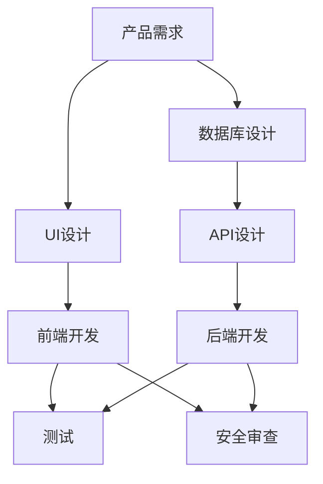

# Result Synthesizer - 结果整合器

## 概述

**核心原则**: 汇总所有 agent 输出，生成完整、结构化的最终报告

收集所有专业 agent 的输出，按维度整合，生成一份完整的报告，包含需求、设计、实现、测试、安全等所有方面。

## 输入

来自 `parallel-executor` 的：
1. 所有 agent 的输出文件/结果
2. 执行状态和摘要
3. 任务清单和依赖关系

## 整合维度

### 1. 需求维度
**Agent**: product-manager

**内容**:
- 产品需求文档 (PRD)
- 功能规格说明
- 用户故事
- 验收标准

### 2. 设计维度
**Agent**: ui-ux-designer

**内容**:
- UI 设计稿
- 交互流程图
- 原型图
- 设计规范

### 3. 架构维度

#### 3.1 数据库架构
**Agent**: database-architect

**内容**:
- 数据模型设计
- 表结构 (schema.sql)
- ER 图
- 索引设计

#### 3.2 API 架构
**Agent**: backend-architect

**内容**:
- API 设计文档
- 接口规范
- 数据格式
- 错误处理

### 4. 实现代码维度

#### 4.1 前端代码
**Agent**: frontend-developer

**内容**:
- 页面组件
- 状态管理
- 样式文件
- 路由配置

#### 4.2 后端代码
**Agent**: backend-developer

**内容**:
- 业务逻辑
- API 实现
- 数据访问层
- 配置文件

### 5. 质量维度

#### 5.1 测试
**Agent**: test-automator

**内容**:
- 测试用例
- 测试覆盖率报告
- 自动化测试脚本

#### 5.2 代码审查
**Agent**: code-reviewer

**内容**:
- 代码质量审查报告
- 改进建议
- 最佳实践

### 6. 安全维度
**Agent**: security-auditor

**内容**:
- 安全审查报告
- 漏洞分析
- 修复建议

## 报告模板

### Markdown 格式

```markdown
# Smart Flow 完整报告

**项目**: {project_name}
**执行 ID**: EXEC-2025-01-07-001
**生成时间**: 2025-01-07 15:20:00
**总耗时**: 45 分钟

---

## 📊 执行摘要

### 任务完成情况
- **总任务数**: 8
- **成功完成**: 7
- **跳过**: 1
- **失败**: 0
- **完成率**: 87.5%

### Agent 分布
- ✅ product-manager (12 分钟)
- ✅ ui-ux-designer (18 分钟)
- ✅ database-architect (14 分钟)
- ⚠️ backend-architect (跳过)
- ✅ frontend-developer (22 分钟)
- ✅ backend-developer (25 分钟)
- ✅ test-automator (15 分钟)
- ✅ security-auditor (12 分钟)

### 时间分布
```
需求澄清: 5 分钟
任务分解: 3 分钟
并行执行: 37 分钟
结果整合: 正在进行中...
```

---

## 1. 产品需求 (PRD)

### 1.1 功能目标
{product_manager_output.objective}

### 1.2 目标用户
{product_manager_output.target_users}

### 1.3 核心功能
{product_manager_output.core_features}

### 1.4 验收标准
{product_manager_output.acceptance_criteria}

---

## 2. 设计方案

### 2.1 UI 设计
{ui_ux_designer_output.ui_design}

### 2.2 交互流程
{ui_ux_designer_output.interaction_flow}

### 2.3 设计规范
{ui_ux_designer_output.design_specs}

---

## 3. 技术架构

### 3.1 数据库设计

#### 数据模型
{database_architect_output.data_model}

#### 表结构
```sql
{database_architect_output.schema_sql}
```

#### ER 图
{database_architect_output.er_diagram}

### 3.2 API 设计

#### 接口列表
{backend_architect_output.api_list}

#### 接口规范
{backend_architect_output.api_specs}

---

## 4. 实现代码

### 4.1 前端代码

#### 页面组件
```vue
{frontend_developer_output.components}
```

#### 状态管理
{frontend_developer_output.state_management}

#### 路由配置
{frontend_developer_output.routing}

### 4.2 后端代码

#### 业务逻辑
```python
{backend_developer_output.business_logic}
```

#### API 实现
{backend_developer_output.api_implementation}

#### 数据访问
{backend_developer_output.data_access}

---

## 5. 质量保证

### 5.1 测试用例
{test_automator_output.test_cases}

### 5.2 测试覆盖率
{test_automator_output.coverage_report}

### 5.3 自动化测试脚本
{test_automator_output.automation_scripts}

---

## 6. 安全审查

### 6.1 安全评估
{security_auditor_output.security_assessment}

### 6.2 漏洞分析
{security_auditor_output.vulnerability_analysis}

### 6.3 修复建议
{security_auditor_output.recommendations}

---

## 7. 代码审查

### 7.1 代码质量
{code_reviewer_output.code_quality}

### 7.2 改进建议
{code_reviewer_output.suggestions}

---

## 8. 部署指南

{deployment_engineer_output.deployment_guide}

---

## 9. 后续步骤

### 9.1 立即可做
- [ ] 代码审查和合并
- [ ] 部署到测试环境
- [ ] 邀请用户测试

### 9.2 短期优化
- [ ] 实现跳过的 backend-architect 任务
- [ ] 补充单元测试
- [ ] 性能优化

### 9.3 长期规划
- [ ] 添加更多功能
- [ ] 优化用户体验
- [ ] 扩展到其他平台

---

## 10. 附录

### 10.1 文件清单
{file_list}

### 10.2 依赖项
{dependencies}

### 10.3 环境变量
{environment_variables}

---

**报告生成时间**: 2025-01-07 15:20:00
**Smart Flow 版本**: v1.0.0
```

## JSON 格式（用于程序处理）

```json
{
  "report_id": "REPORT-2025-01-07-001",
  "execution_id": "EXEC-2025-01-07-001",
  "timestamp": "2025-01-07T15:20:00Z",

  "summary": {
    "total_tasks": 8,
    "completed": 7,
    "skipped": 1,
    "failed": 0,
    "completion_rate": "87.5%",
    "total_duration": "45 minutes"
  },

  "dimensions": {
    "requirements": {
      "agent": "product-manager",
      "output_file": "docs/prd.md",
      "key_points": ["功能目标", "目标用户", "核心功能"]
    },
    "design": {
      "agent": "ui-ux-designer",
      "output_file": "docs/ui-design.md",
      "key_points": ["UI设计", "交互流程", "设计规范"]
    },
    "architecture": {
      "database": {
        "agent": "database-architect",
        "output_file": "docs/database-schema.sql",
        "key_points": ["数据模型", "表结构", "ER图"]
      },
      "api": {
        "agent": "backend-architect",
        "status": "skipped",
        "reason": "用户取消"
      }
    },
    "implementation": {
      "frontend": {
        "agent": "frontend-developer",
        "output_files": ["src/components/Login.vue", "src/store/auth.js"]
      },
      "backend": {
        "agent": "backend-developer",
        "output_files": ["app/views/auth.py", "app/models/user.py"]
      }
    },
    "quality": {
      "testing": {
        "agent": "test-automator",
        "output_file": "tests/test_auth.py",
        "coverage": "85%"
      },
      "security": {
        "agent": "security-auditor",
        "output_file": "docs/security-audit.md",
        "vulnerabilities": "0 critical, 1 important"
      }
    }
  },

  "next_steps": [
    "代码审查和合并",
    "部署到测试环境",
    "邀请用户测试",
    "补充 backend-architect 任务"
  ],

  "files_generated": [
    "docs/prd.md",
    "docs/ui-design.md",
    "docs/database-schema.sql",
    "src/components/Login.vue",
    "src/store/auth.js",
    "app/views/auth.py",
    "app/models/user.py",
    "tests/test_auth.py",
    "docs/security-audit.md"
  ]
}
```

## 生成流程

```python
def synthesize_results(execution_result):
    report = {
        "summary": generate_summary(execution_result),
        "dimensions": {}
    }

    # 按维度整合
    for dimension in DIMENSIONS:
        agent_outputs = get_agent_outputs_for_dimension(dimension)
        report["dimensions"][dimension] = integrate_outputs(agent_outputs)

    # 生成 Markdown 报告
    markdown_report = render_markdown_template(report)
    save_file("smart-flow-report-{date}.md", markdown_report)

    # 生成 JSON 报告
    json_report = render_json_template(report)
    save_file("smart-flow-report-{date}.json", json_report)

    # 生成执行摘要
    print_execution_summary(report)

    return report
```

## 可视化报告

### 依赖关系图


### 时间线图
```
14:30 ┤ 需求澄清 (5m) ─────────────────────────┐
14:35 ┤ 任务分解 (3m) ──────────────┐          │
14:38 ┤ 并行执行 ──────────────────┼──────────┤
       ├─ 产品经理 (12m) ────┐      │          │
       ├─ UI设计师 (18m) ─────┼─────┤          │
       ├─ DB架构师 (14m) ─────┼─────┼────┐     │
       └─ 后端架构师 (跳过)    │     │    │     │
       ├─ 前端开发 (22m) ─────┼─────┼────┼───┐ │
       └─ 后端开发 (25m) ─────────┘    │    │   │
       ├─ 测试工程师 (15m) ────────────┘    │   │
       └─ 安全专家 (12m) ──────────────────┘   │
15:20 ┤ 结果整合 ───────────────────────────┘
```

## 质量检查

### 报告完整性检查
- [ ] 所有维度的输出都已包含
- [ ] 没有 agent 输出丢失
- [ ] 文件路径正确
- [ ] 代码可运行
- [ ] 文档清晰完整

### 特殊情况处理
- **Agent 失败**: 标注失败原因，继续其他部分
- **部分输出**: 仅包含已生成的输出
- **输出冲突**: 标注冲突，提供多个版本

## 交付物

### 文件清单
1. `smart-flow-report-YYYY-MM-DD.md` - Markdown 完整报告
2. `smart-flow-report-YYYY-MM-DD.json` - JSON 结构化报告
3. `smart-flow-execution-YYYY-MM-DD.json` - 执行状态记录
4. 所有 agent 生成的文件（代码、文档等）

## 验证检查清单

结果整合完成后：
- [ ] 报告包含所有维度
- [ ] Markdown 报告可读性强
- [ ] JSON 报告结构完整
- [ ] 所有文件路径正确
- [ ] 执行摘要清晰

## 完成

```
✅ Smart Flow 执行完成！

报告已生成:
- smart-flow-report-2025-01-07.md
- smart-flow-report-2025-01-07.json

执行摘要:
- 总耗时: 45 分钟
- 完成率: 87.5%
- 成功任务: 7/8

感谢使用 Smart Flow! 🎉
```

---

**前置技能**: `smart-flow:parallel-executor`
**后续技能**: 无 (流程结束)
**版本**: v1.0.0
