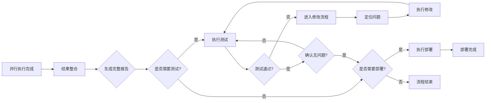

# Result Synthesizer - 结果整合器

## 概述

**核心原则**: 闭环开发流程 - 整合 → **测试循环(直到无bug)** → 部署上线

收集所有专业 agent 的输出，按维度整合生成报告，然后引导用户完成**测试、修改、再测试的循环**，确保代码完全没问题后才部署上线。

**重要**: 部署后的测试和反馈不在本系统考虑范围内（那是运维阶段）。

## 输入

来自 `parallel-executor` 的：
1. 所有 agent 的输出文件/结果
2. 执行状态和摘要
3. 任务清单和依赖关系

---

## 🔄 完整闭环流程



**核心原则**: 测试和修改在部署前完成,确保代码无问题后才部署。部署后的测试和反馈不在本系统考虑范围内。

---

## 📋 Phase 1: 结果整合 (30%)

### 整合维度

#### 1. 需求维度
**Agent**: product-manager

**内容**:
- 产品需求文档 (PRD)
- 功能规格说明
- 用户故事
- 验收标准

#### 2. 设计维度
**Agent**: ui-ux-designer

**内容**:
- UI 设计稿
- 交互流程图
- 原型图
- 设计规范

#### 3. 架构维度

##### 3.1 数据库架构
**Agent**: database-architect

**内容**:
- 数据模型设计
- 表结构 (schema.sql)
- ER 图
- 索引设计

##### 3.2 API 架构
**Agent**: backend-architect

**内容**:
- API 设计文档
- 接口规范
- 数据格式
- 错误处理

#### 4. 实现代码维度

##### 4.1 前端代码
**Agent**: frontend-developer

**内容**:
- 页面组件
- 状态管理
- 样式文件
- 路由配置

##### 4.2 后端代码
**Agent**: backend-developer

**内容**:
- 业务逻辑
- API 实现
- 数据访问层
- 配置文件

#### 5. 质量维度

##### 5.1 测试
**Agent**: test-automator (如果已执行)

**内容**:
- 测试用例
- 测试覆盖率报告
- 自动化测试脚本

##### 5.2 代码审查
**Agent**: code-reviewer (如果已执行)

**内容**:
- 代码质量审查报告
- 改进建议
- 最佳实践

##### 5.3 安全审查
**Agent**: security-auditor (如果已执行)

**内容**:
- 安全审查报告
- 漏洞分析
- 修复建议

### 生成完整报告

**文件**:
- `smart-flow-report-YYYY-MM-DD.md` - Markdown 完整报告
- `smart-flow-report-YYYY-MM-DD.json` - JSON 结构化报告

**示例报告**:

```markdown
# Smart Flow 完整报告

**项目**: 用户登录功能
**执行 ID**: EXEC-2025-01-07-001
**生成时间**: 2025-01-07 15:20:00
**总耗时**: 45 分钟

---

## 📊 执行摘要

### 任务完成情况
- **总任务数**: 6
- **成功完成**: 6
- **完成率**: 100%

### Agent 分布
- ✅ product-manager (12 分钟)
- ✅ ui-ux-designer (18 分钟)
- ✅ database-architect (14 分钟)
- ✅ backend-architect (15 分钟)
- ✅ frontend-developer (22 分钟)
- ✅ backend-developer (20 分钟)

---

## 1. 产品需求 (PRD)
[详细内容...]

## 2. 设计方案
[详细内容...]

## 3. 技术架构
[详细内容...]

## 4. 实现代码
[详细内容...]

---

**报告生成完成！下一步：测试与部署**
```

---

## 🧪 Phase 2: 询问测试需求 (20%)

### 使用 AskUserQuestion 询问用户

```markdown
✅ 完整报告已生成！

## 🤔 是否需要测试？

代码已完成，建议先进行测试再部署。

### 测试选项

**请选择测试方式**:

1. **自动化测试** (推荐)
   - 使用 test-automator 编写测试用例
   - 运行自动化测试脚本
   - 生成测试覆盖率报告
   - 预计耗时: 15-20分钟

2. **手动测试**
   - 手动运行代码
   - 手动测试核心功能
   - 不生成测试脚本
   - 预计耗时: 10-15分钟

3. **跳过测试**
   - 直接进入部署环节
   - ⚠️ 不推荐，可能导致线上问题

4. **查看报告，稍后决定**
   - 先查看完整报告
   - 稍后决定是否测试

您的选择?
```

**实现**:

```python
# 使用 AskUserQuestion 工具
user_choice = ask_user(
    "完整报告已生成！是否需要测试？",
    options=[
        "自动化测试 (推荐)",
        "手动测试",
        "跳过测试",
        "查看报告，稍后决定"
    ]
)

if user_choice == "自动化测试":
    enter_testing_phase()
elif user_choice == "手动测试":
    provide_manual_testing_guide()
elif user_choice == "跳过测试":
    ask_about_deployment()
else:  # 查看报告
    display_full_report()
```

---

## 🧪 Phase 3: 执行测试 (30%)

### 如果用户选择"自动化测试"

#### Step 1: 启动 test-automator Agent

```python
Task({
    subagent_type: "test-automator",
    prompt: f"""
根据以下报告生成测试用例和自动化测试脚本：

项目信息:
{report_summary}

实现代码:
- 前端: {frontend_files}
- 后端: {backend_files}

要求:
1. 编写单元测试
2. 编写集成测试
3. 生成测试覆盖率报告
4. 提供测试执行脚本
    """,
    description: "生成测试用例和自动化测试",
    run_in_background: false  # 测试不需要后台运行
})
```

#### Step 2: 测试完成后的处理

**测试通过**:

```markdown
✅ 测试通过！

所有测试用例执行成功：
- 单元测试: ✅ 15/15 通过
- 集成测试: ✅ 8/8 通过
- 测试覆盖率: 85%
```

**确认无问题后再部署**:

```python
ask_user(
    "✅ 测试通过！确认代码完全没有问题了吗？",
    options=[
        "确认无问题，进入部署",
        "还需要再测试一轮",
        "暂不部署"
    ]
)

if user_choice == "确认无问题，进入部署":
    ask_about_deployment()
elif user_choice == "还需要再测试一轮":
    rerun_tests()
else:  # 暂不部署
    end_flow()
```

**测试失败**:

```markdown
❌ 测试失败！

测试结果:
- 单元测试: ✅ 13/15 通过
- 集成测试: ❌ 2/8 失败
- 失败原因:
  1. 用户登录API返回500错误
  2. 前端登录页面无法加载用户信息

需要进入修改流程吗？
```

```python
ask_user(
    "❌ 测试失败！需要进入修改流程吗？",
    options=[
        "立即修改",
        "稍后修改",
        "查看详细错误"
    ]
)
```

---

## 🔧 Phase 4: 修改流程 (20%)

### 如果用户选择"立即修改"

#### Step 1: 询问修改方式

```markdown
## 🔧 修改流程

### 可用选项

1. **自动定位并修复** (推荐)
   - 使用 debugger 定位问题
   - 使用 auto-fix 自动修复
   - 预计耗时: 10-15分钟

2. **手动修复**
   - 查看详细错误信息
   - 手动修改代码
   - 预计耗时: 15-30分钟

3. **查看测试报告**
   - 查看详细错误日志
   - 分析失败原因
   - 稍后决定

您的选择?
```

#### Step 2: 执行修改

**选项1: 自动定位并修复**

```python
# Step 1: 使用 debugger 定位问题
Task({
    subagent_type: "debugger",
    prompt: f"""
以下测试失败了，请定位问题：

测试失败信息:
{test_failures}

相关代码:
- 前端: {frontend_files}
- 后端: {backend_files}

请:
1. 分析失败原因
2. 定位问题代码
3. 提供修复建议
    """,
    description: "定位测试失败问题"
})

# Step 2: 使用 auto-fix 自动修复
Task({
    subagent_type: "auto-fix",
    prompt: f"""
根据 debugger 的分析结果，自动修复代码：

问题分析:
{debugger_analysis}

待修复文件:
- {file1}: {issue1}
- {file2}: {issue2}

请自动修复这些问题。
    """,
    description: "自动修复代码"
})
```

**选项2: 手动修复**

```python
# 提供详细错误报告
display_detailed_error_report({
    "test_failures": test_failures,
    "error_logs": error_logs,
    "suggestions": suggestions
})

# 等待用户手动修改
wait_for_user_manual_fix()
```

#### Step 3: 修改完成后重新测试

```python
# 修改完成后，自动重新运行测试
rerun_tests()

# 检查测试结果
if tests_passed():
    # 测试通过后，再次确认用户是否满意
    ask_user(
        "✅ 修改后测试通过！确认代码完全没问题了吗？",
        options=[
            "确认无问题，进入部署",
            "还需要再测试一轮"
        ]
)
else:
    # 如果还是失败，继续修改循环
    if current_fix_attempt < MAX_FIX_ATTEMPTS:
        ask_user(
            f"修改尝试 {current_fix_attempt}/{MAX_FIX_ATTEMPTS} 完成，但测试仍未通过",
            options=[
                "继续自动修改",
                "手动介入"
            ]
        )
    else:
        print("⚠️ 已达到最大修改次数，建议手动介入")
```

---

## 🚀 Phase 5: 部署上线 (20%)

### 如果用户选择"立即部署"

#### Step 1: 询问部署方式

```markdown
## 🚀 部署准备

### 部署环境

**请选择部署方式**:

1. **本地部署** (快速)
   - 部署到本地开发环境
   - 适合快速验证
   - 预计耗时: 5-10分钟

2. **测试环境部署** (推荐)
   - 部署到测试服务器
   - 适合团队验证
   - 预计耗时: 15-20分钟

3. **生产环境部署**
   - 部署到生产服务器
   - ⚠️ 需要确保测试通过
   - 预计耗时: 20-30分钟

4. **稍后部署**
   - 暂时不部署

您的选择?
```

#### Step 2: 执行部署

**根据用户选择启动对应的部署流程**:

```python
if user_choice == "本地部署":
    Task({
        subagent_type: "windows-fullstack-deploy",
        prompt: "部署到本地开发环境...",
        description: "本地部署"
    })
elif user_choice == "测试环境部署":
    Task({
        subagent_type: "db-deploy",
        prompt: "部署到测试服务器...",
        description: "测试环境部署"
    })
elif user_choice == "生产环境部署":
    Task({
        subagent_type: "deployment-engineer",
        prompt = "部署到生产服务器...",
        description: "生产环境部署"
    })
```

#### Step 3: 部署完成

```markdown
🎉 部署成功！

### 部署信息
- **部署环境**: {env}
- **部署时间**: 2025-01-07 16:00:00
- **访问地址**: {url}

### 下一步建议
- [ ] 验证部署结果
- [ ] 邀请用户验收
- [ ] 监控运行状态
- [ ] 收集用户反馈

感谢使用 Smart Flow! 🚀
```

---

## 📊 完整流程示例

```markdown
## Smart Flow 闭环流程示例

### Phase 1: 结果整合 (30%)
✅ 生成完整报告
   - 产品需求
   - 设计方案
   - 技术架构
   - 实现代码

### Phase 2: 询问测试 (20%)
Q: 是否需要测试?
A: 自动化测试

### Phase 3: 执行测试 (30%)
🔄 运行 test-automator
   - 编写测试用例
   - 运行自动化测试
   - 生成覆盖率报告

结果: ❌ 2个测试失败

### Phase 4: 修改流程 (20%)
Q: 需要修改吗?
A: 立即修改

🔄 修改循环:
  1. 使用 debugger 定位问题
  2. 使用 auto-fix 自动修复
  3. 重新运行测试
  4. ✅ 测试通过

Q: 确认代码完全没问题了吗?
A: 确认无问题，进入部署

### Phase 5: 部署上线 (20%)
Q: 需要部署到哪个环境?
A: 测试环境部署

🔄 执行 db-deploy
  - 部署到测试服务器
  - 验证部署结果
  - ✅ 部署成功

### 完成
🎉 Smart Flow 完整闭环完成！

**流程特点**:
- ✅ 测试和修改循环在部署前完成
- ✅ 确认无问题后才部署
- ✅ 部署是最后的步骤
- ✅ 部署后的测试和反馈不在本系统范围内
```

---

## 🔄 修改循环机制

### 无限修改保护

为了避免无限循环，设置最大修改次数：

```python
MAX_FIX_ATTEMPTS = 3
current_fix_attempt = 0

while not tests_passed() and current_fix_attempt < MAX_FIX_ATTEMPTS:
    current_fix_attempt += 1

    print(f"🔄 修改尝试 {current_fix_attempt}/{MAX_FIX_ATTEMPTS}")

    # 定位问题
    debugger_result = run_debugger()

    # 执行修改
    fix_result = run_auto_fix(debugger_result)

    # 重新测试
    if tests_passed():
        break
    else:
        ask_user_continue()

if current_fix_attempt >= MAX_FIX_ATTEMPTS:
    print("⚠️ 已达到最大修改次数，建议手动介入")
```

### 用户中断机制

每次修改后，都给用户选择：

```python
ask_user(
    f"修改尝试 {current_fix_attempt}/{MAX_FIX_ATTEMPTS} 完成",
    options=[
        "继续修改",
        "手动介入"
    ]
)
```

**重要**:
- 不提供"跳过测试直接部署"选项
- 必须确保测试通过后才能部署
- 部署是最后的步骤，在部署前要确认所有问题都已解决

---

## ✅ 完成检查清单

结果整合完成后：
- [ ] 报告包含所有维度
- [ ] Markdown 报告可读性强
- [ ] JSON 报告结构完整
- [ ] 所有文件路径正确
- [ ] 执行摘要清晰

测试完成后（如果执行测试）：
- [ ] 测试用例完整
- [ ] 测试结果清晰
- [ ] 失败原因明确

部署完成后（如果执行部署）：
- [ ] 部署成功
- [ ] 访问地址可用
- [ ] 部署信息完整

---

## 🎯 后续步骤

完整闭环完成后：

### 短期（当天）
- [ ] 验证部署结果
- [ ] 邀请用户验收
- [ ] 监控运行状态

### 中期（本周）
- [ ] 收集用户反馈
- [ ] 优化性能
- [ ] 补充文档

### 长期（本月）
- [ ] 迭代新功能
- [ ] 优化用户体验
- [ ] 扩展到其他平台

---

**前置技能**: `smart-flow:parallel-executor`
**后续技能**: `test-automator`, `auto-fix`, `debugger`, `deployment-engineer`, `db-deploy`
**版本**: v2.1.0
