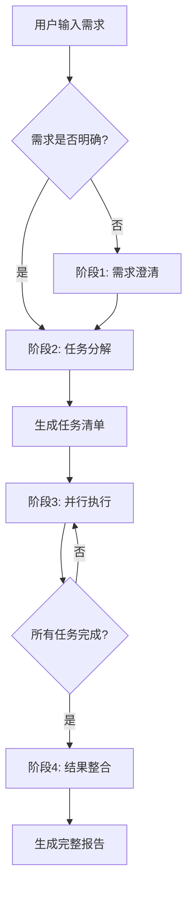

# Smart Workflow - 智能任务调度工作流

## 概述

Smart Workflow 是一个全自动化的开发工作流，通过需求澄清、任务分解、并行执行、结果整合四大阶段，大幅提升开发效率。

**核心理念**: "先搞清楚要做什么，再找合适的专家同时开工"

## 触发条件

### 自动触发
当用户输入包含以下情况时自动启动：
- "新增"、"开发"、"实现"、"制作"、"创建" + 功能描述
- 需求描述少于 50 字
- 包含模糊词汇："大概"、"可能"、"应该"、"像..."
- 用户说"帮我做一个功能"

### 手动触发
用户输入命令：
- `/smart-flow` 或 `/sf`
- `/smart-flow start`

## 工作流程

### 阶段 1: 需求澄清 (Requirements Clarity)

**⚠️ 强制要求**: 必须使用 `AskUserQuestion` 工具！

**执行步骤**:
1. **立即调用 `AskUserQuestion` 工具**
   - 设计 2-4 个关键问题
   - 每个问题提供 2-4 个选项
   - 支持多选时设置 `multiSelect: true`

2. **等待用户回答**
   - 不要假设用户想要什么
   - 不要自己编造需求

3. **生成结构化需求文档**
   - 基于用户的回答
   - 输出 JSON 格式

**目标**: 强制询问，不允许猜测

**核心问题**:
1. **功能目标**: 解决什么问题？达到什么效果？
2. **目标用户**: 谁会使用这个功能？
3. **核心功能**: 哪些是必须功能？哪些是可选功能？
4. **技术栈偏好**: 前端/后端/数据库/框架有特定要求吗？
5. **约束条件**: 时间/性能/安全/兼容性方面的约束？
6. **参考资料**: 有类似的实现或竞品可以参考吗？

**输出**: 结构化需求文档 (JSON 格式)

**技能**: `smart-flow:requirements-clarity`

---

### 阶段 2: 任务分解 (Task Decomposer)

**目标**: 自动识别需要哪些专业领域

**分解逻辑**:
```python
需求关键词 → 专业 Agent (智能匹配)

# 示例
["用户界面", "UI", "页面", "交互"]
→ ui-ux-designer + frontend-developer

["数据库", "数据模型", "表结构", "ER图"]
→ database-architect

["API", "接口", "REST", "GraphQL"]
→ backend-architect + api-documenter

["测试", "质量", "测试用例"]
→ test-automator

["安全", "漏洞", "认证", "权限"]
→ security-auditor
```

**输出**: 任务清单 (包含依赖关系和优先级)

**技能**: `smart-flow:task-decomposer`

---

### 阶段 3: 并行执行 (Parallel Executor)

**目标**: 同时启动多个专业 agent

**执行策略**:
- **并行阶段**: 无依赖的任务同时执行
- **串行阶段**: 有依赖的任务等待前置任务完成
- **进度追踪**: 实时显示每个 agent 的状态

**示例**:
```
并行阶段 1 (立即启动):
  ✅ product-manager (产品经理)
  ✅ ui-ux-designer (UI/UX 设计师)
  ✅ database-architect (数据库架构师)

并行阶段 2 (依赖阶段 1):
  ✅ backend-architect (后端架构师) [依赖: 数据库架构]
  ✅ frontend-developer (前端开发) [依赖: UI 设计]

并行阶段 3 (依赖阶段 2):
  ✅ test-automator (测试工程师) [依赖: 前后端代码]
  ✅ security-auditor (安全专家) [依赖: 前后端代码]
```

**技能**: `smart-flow:parallel-executor`

---

### 阶段 4: 结果整合 (Result Synthesizer)

**目标**: 汇总所有 agent 输出，生成完整报告

**整合维度**:
1. **需求维度**: 产品需求文档 (PRD)
2. **设计维度**: UI/UX 设计稿
3. **架构维度**: 系统架构设计、API 文档、数据库 schema
4. **代码维度**: 前端/后端实现代码
5. **质量维度**: 测试用例、测试报告
6. **安全维度**: 安全审查报告

**输出**: Markdown 格式的完整报告

**技能**: `smart-flow:result-synthesizer`

---

## 完整流程图



---

## 支持的专业 Agent (40+)

### 核心开发 (8个)
- `product-manager` - 产品经理
- `ui-ux-designer` - UI/UX 设计师
- `database-architect` - 数据库架构师
- `backend-architect` - 后端架构师
- `frontend-developer` - 前端开发
- `backend-developer` - 后端开发
- `test-automator` - 测试工程师
- `security-auditor` - 安全专家

### API & 文档 (3个)
- `api-documenter` - API 文档工程师
- `documentation-architect` - 技术文档架构师
- `graphql-architect` - GraphQL 架构师

### 数据库 (4个)
- `database-optimizer` - 数据库优化专家
- `database-optimization` - 数据库性能调优
- `database-admin` - 数据库管理员
- `sql-expert` - SQL 专家

### 部署 & 运维 (8个)
- `deployment-engineer` - 部署工程师
- `devops-troubleshooter` - DevOps 故障排查
- `cloud-architect` - 云架构师
- `windows-fullstack-deploy` - Windows 全栈部署
- `db-deploy` - 数据库部署专家
- `github-actions-runner` - GitHub Actions 专家
- `terraform-specialist` - Terraform 专家
- `incident-responder` - 生产事故处理

### 性能 & 质量 (5个)
- `performance-engineer` - 性能工程师
- `react-performance-optimization` - React 性能优化
- `code-reviewer` - 代码审查工程师
- `architect-review` - 架构审查
- `legacy-modernizer` - 遗留代码现代化

### 编程语言专项 (11个)
- `python-expert` - Python 专家
- `typescript-expert` - TypeScript 专家
- `javascript-developer` - JavaScript 开发
- `golang-expert` - Go 专家
- `java-developer` - Java 开发
- `cpp-engineer` - C++ 工程师
- `rust-expert` - Rust 专家
- `c-developer` - C 语言专家
- `php-developer` - PHP 开发
- `ruby-expert` - Ruby 专家
- `sql-expert` - SQL 专家

### AI & 数据 (7个)
- `ai-engineer` - AI 工程师
- `prompt-engineer` - Prompt 优化专家
- `data-engineer` - 数据工程师
- `ml-engineer` - 机器学习工程师
- `mlops-engineer` - MLOps 工程师
- `data-scientist` - 数据科学家
- `data-analyst` - 数据分析师

### 研究 & 分析 (6个)
- `research-orchestrator` - 研究协调器
- `comprehensive-researcher` - 综合研究员
- `technical-researcher` - 技术研究员
- `academic-researcher` - 学术研究员
- `market-research-analyst` - 市场研究分析师
- `search-specialist` - 搜索专家

### 其他领域 (15+)
- `network-engineer` - 网络工程师
- `debugger` - 调试专家
- `error-detective` - 错误侦探
- `mobile-developer` - 移动开发
- `ios-developer` - iOS 开发
- `directus-developer` - Directus 开发
- `drupal-developer` - Drupal 开发
- `wordpress-developer` - WordPress 开发
- `command-expert` - CLI 专家
- `blockchain-developer` - 区块链开发
- `crypto-trader` - 加密货币交易系统
- `arbitrage-bot` - 套利机器人
- `mcp-expert` - MCP 专家
- `test-automator` - 测试自动化
- `deployment-test` - 部署测试

---

## 高级特性

### 1. 增量执行和断点续传
- 保存执行状态到 JSON 文件
- 重启时询问"继续上次任务?"
- 仅执行失败或未完成的任务

### 2. 历史记录和版本管理
- 每次执行生成唯一 ID
- 保存完整的需求、任务、结果
- 支持查看历史记录
- 支持基于历史记录创建新任务

### 3. 进度可视化
实时显示执行进度：
```
⏳ Smart Flow 执行进度

✅ 阶段 1: 需求澄清 (100%)
✅ 阶段 2: 任务分解 (100%)
⏳ 阶段 3: 并行执行 (60%)
   ✅ 产品经理 (100%) - 5 分钟
   ✅ UI/UX 设计师 (100%) - 8 分钟
   ✅ 数据库架构师 (100%) - 6 分钟
   ⏳ 后端架构师 (50%) - 预计 3 分钟
   ⏳ 前端开发 (30%) - 预计 10 分钟
⏸ 阶段 4: 结果整合 (0%) - 等待中
```

### 4. 依赖关系可视化
生成任务依赖关系图 (Mermaid 格式)

### 5. 自定义 Agent 配置
允许用户添加/修改 agent 配置

---

## 错误处理

- **Agent 失败**: 记录错误并继续其他任务
- **重试机制**: 提供"重试失败任务"选项
- **部分成功**: 最终报告中标注失败的任务

---

## 与 Superpowers 的关系

Smart Flow 可以**复用 Superpowers 的技能**：
- `brainstorming` → 需求澄清
- `writing-plans` → 任务分解
- `dispatching-parallel-agents` → 并行执行
- `requesting-code-review` → 结果整合

**核心区别**：
- **Superpowers**: 手动调用技能 (`/superpowers:brainstorm`)
- **Smart Flow**: 自动触发完整工作流，一次性完成

---

## 使用示例

### 示例 1: 自动触发
```
你: 帮我做一个用户登录功能

Smart Flow: 检测到模糊需求，启动需求澄清流程...
[进入阶段 1: 需求澄清]
```

### 示例 2: 手动触发
```
你: /smart-flow

Smart Flow: 启动智能任务调度流程...
[进入阶段 1: 需求澄清]
```

### 示例 3: 完整流程
```
你: /smart-flow start
我想做一个电商网站的商品管理功能

Smart Flow:
[阶段 1: 需求澄清]
- 目标用户是谁?
- 核心功能有哪些?
- ...

[阶段 2: 任务分解]
- 产品经理: 需求文档
- UI/UX 设计师: 界面设计
- 数据库架构师: 数据模型
- 后端架构师: API 设计
- 前端开发: 页面实现
- 测试工程师: 测试用例
- 安全专家: 安全审查

[阶段 3: 并行执行]
⏳ 正在同时执行 7 个 agent...

[阶段 4: 结果整合]
✅ 完整报告已生成: smart-flow-report-2025-01-07.md
```

---

## 核心价值

1. ✅ **拒绝猜测**: 强制需求澄清，避免 AI "自作聪明"
2. ✅ **并行加速**: 同时调用多个专业 agent，10x 提升效率
3. ✅ **全面覆盖**: 产品、设计、开发、测试、安全一站式解决
4. ✅ **智能整合**: 自动汇总所有输出，生成完整报告

---

## 安装

参见 [INSTALL.md](../../INSTALL.md)

---

## 文档

- [ARCHITECTURE.md](../../docs/ARCHITECTURE.md) - 架构设计
- [AGENT_LIST.md](../../docs/AGENT_LIST.md) - 支持 Agent 列表
- [CUSTOMIZATION.md](../../docs/CUSTOMIZATION.md) - 自定义指南

---

**版本**: v2.1.0
**最后更新**: 2026-01-07
**作者**: Smart Flow Team
**许可**: MIT License
