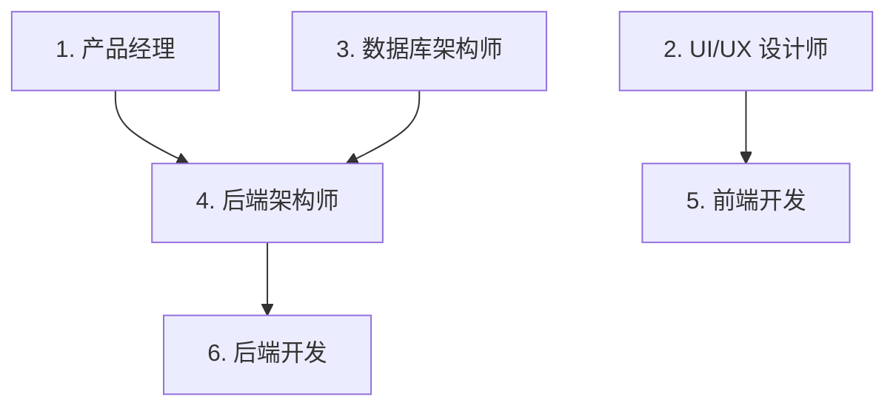

# Task Decomposer - 任务分解器

## 概述

**核心原则**: 自动识别需要哪些专业领域，智能推荐 Agent 组合和并行策略

基于已澄清的需求，智能识别需要哪些专业 agent，生成任务清单、依赖关系和执行顺序。

## 输入

来自 `requirements-clarity` 的结构化需求文档（JSON 格式）

---

## 🎯 智能推荐系统

### Step 1: 任务复杂度评估

**参考**: `utils/smart-recommender.md`

```yaml
评估维度:
  功能数量: [1-3个 | 4-7个 | 8+个]
  技术栈数量: [1-2个 | 3-4个 | 5+个]
  集成复杂度: [无 | 1-2个API | 3+个系统]
  数据复杂度: [简单CRUD | 多表关联 | 分布式]
  用户规模: [个人 | 小团队 | 企业级]

复杂度计算:
  简单: 0-40分
  中等: 41-70分
  复杂: 71-100分
```

### Step 2: 推荐 Agent 组合

```yaml
简单任务 (0-40分):
  推荐Agent: 2个
    - product-manager
    - frontend-developer
  并行数: 2个

中等任务 (41-70分):
  推荐Agent: 5个
    批次1 (并行):
      - product-manager
      - ui-ux-designer
      - database-architect
    批次2 (并行):
      - backend-architect
      - frontend-developer
      - backend-developer
  并行数: 3-4个

复杂任务 (71-100分):
  推荐Agent: 8个
    批次1 (并行):
      - product-manager
      - ui-ux-designer
      - database-architect
      - architect-review
    批次2 (并行):
      - backend-architect
      - frontend-developer
      - backend-developer
      - api-documenter
    批次3 (并行):
      - test-automator
      - security-auditor
      - performance-engineer
      - code-reviewer
  并行数: 5-7个
```

### Step 3: 用户配置界面

**使用 `AskUserQuestion` 工具**：

```markdown
## Smart Flow Agent 配置

智能推荐已根据您的需求分析:
- **复杂度**: [简单/中等/复杂] ([X]/100分)
- **推荐 Agent**: [X]个
- **推荐并行数**: [X]个

### 核心开发 Agent (已预选)

以下 Agent 已根据需求智能推荐并预选:

[✓] product-manager (产品经理)
[✓] ui-ux-designer (UI/UX 设计师)
[✓] database-architect (数据库架构师)
[✓] backend-architect (后端架构师)
[✓] frontend-developer (前端开发)
[✓] backend-developer (后端开发)

### 可选 Agent

您还可以添加以下专业 Agent:

[ ] test-automator (测试自动化)
[ ] security-auditor (安全审计)
[ ] performance-engineer (性能工程师)
[ ] api-documenter (API 文档)
[ ] code-reviewer (代码审查)
[ ] deployment-engineer (部署工程师)

### 并行配置

同时运行几个 Agent?

  (•) [推荐数量]个 (推荐)
  ( ) [推荐数量+2]个 (快速)
  ( ) [推荐数量-1]个 (稳定)

### 确认执行

准备好启动 Smart Flow 了吗?
  [1. 确认并启动  2. 调整配置  3. 取消]
```

---

## 🔄 分解逻辑

### 关键词 → Agent 映射

#### 产品 & 设计
```python
关键词 → Agent

["用户需求", "产品", "功能模块", "PRD", "需求文档"]
→ product-manager

["UI", "界面", "页面", "交互", "设计稿", "原型"]
→ ui-ux-designer

["前端", "网页", "Vue", "React", "组件", "页面实现"]
→ frontend-developer
```

#### 架构 & API
```python
["架构", "系统架构", "设计", "技术选型"]
→ backend-architect

["API", "接口", "REST", "GraphQL", "API设计"]
→ backend-architect + api-documenter

["API文档", "接口文档", "OpenAPI", "Swagger"]
→ api-documenter
```

#### 数据库
```python
["数据库", "数据模型", "表结构", "ER图", "schema"]
→ database-architect

["SQL", "查询", "SQL优化", "慢查询"]
→ sql-expert + database-optimizer

["数据库迁移", "数据迁移"]
→ database-optimizer
```

#### 后端开发
```python
["后端", "服务端", "业务逻辑", "API实现"]
→ backend-developer

["Python", "Python代码", "Py"]
→ python-expert

["Go", "Golang", "Go代码"]
→ golang-expert
```

#### 测试 & 质量
```python
["测试", "质量", "测试用例", "单元测试", "E2E"]
→ test-automator

["代码审查", "review", "代码检查"]
→ code-reviewer

["性能", "优化", "加速", "性能优化"]
→ performance-engineer
```

#### 安全
```python
["安全", "漏洞", "认证", "权限", "渗透"]
→ security-auditor

["API安全", "接口安全"]
→ api-security-auditor
```

#### 部署 & 运维
```python
["部署", "上线", "发布", "CI/CD"]
→ deployment-engineer

["Docker", "容器", "镜像"]
→ deployment-engineer

["Kubernetes", "K8s"]
→ deployment-engineer + cloud-architect

["GitHub Actions", "GHA", "工作流"]
→ github-actions-runner
```

#### AI & 数据
```python
["LLM", "大语言模型", "AI应用", "RAG"]
→ ai-engineer

["Prompt", "提示词", "Prompt优化"]
→ prompt-engineer

["数据管道", "ETL", "数据仓库"]
→ data-engineer
```

---

## 📊 依赖关系识别

### 无依赖任务（可并行）
- 产品需求文档 ← 独立
- UI/UX 设计 ← 独立
- 数据库架构设计 ← 独立

### 有依赖任务（需等待）
- API 设计 ← 依赖：数据库架构
- 前端开发 ← 依赖：UI 设计
- 后端开发 ← 依赖：API 设计
- 测试用例 ← 依赖：前后端代码
- 安全审查 ← 依赖：前后端代码

---

## 📝 输出格式

### JSON 格式

```json
{
  "decomposition_id": "DECOMP-2025-01-07-001",
  "timestamp": "2025-01-07T14:35:22Z",
  "requirement_id": "REQ-2025-01-07-001",

  "complexity_analysis": {
    "score": 62,
    "level": "中等",
    "details": {
      "feature_count": 6,
      "tech_count": 4,
      "integration_complexity": "low",
      "data_complexity": "medium",
      "user_scale": "medium"
    }
  },

  "recommendation": {
    "total_agents": 6,
    "parallel_count": 3,
    "estimated_time": "50分钟",
    "agents": [
      "product-manager",
      "ui-ux-designer",
      "database-architect",
      "backend-architect",
      "frontend-developer",
      "backend-developer"
    ]
  },

  "total_tasks": 6,
  "parallel_stages": 2,

  "tasks": [
    {
      "id": 1,
      "name": "产品需求文档",
      "agent": "product-manager",
      "priority": "高",
      "stage": 1,
      "dependencies": [],
      "description": "编写完整的产品需求文档",
      "estimated_time": "12分钟"
    },
    {
      "id": 2,
      "name": "UI/UX 设计",
      "agent": "ui-ux-designer",
      "priority": "高",
      "stage": 1,
      "dependencies": [],
      "description": "设计用户界面和交互流程",
      "estimated_time": "15分钟"
    },
    {
      "id": 3,
      "name": "数据库架构设计",
      "agent": "database-architect",
      "priority": "高",
      "stage": 1,
      "dependencies": [],
      "description": "设计数据模型和表结构",
      "estimated_time": "10分钟"
    },
    {
      "id": 4,
      "name": "API 设计",
      "agent": "backend-architect",
      "priority": "中",
      "stage": 2,
      "dependencies": [3],
      "description": "设计 REST API 接口",
      "estimated_time": "15分钟"
    },
    {
      "id": 5,
      "name": "前端开发",
      "agent": "frontend-developer",
      "priority": "中",
      "stage": 2,
      "dependencies": [2],
      "description": "实现用户界面",
      "estimated_time": "25分钟"
    },
    {
      "id": 6,
      "name": "后端开发",
      "agent": "backend-developer",
      "priority": "中",
      "stage": 2,
      "dependencies": [4],
      "description": "实现业务逻辑和 API",
      "estimated_time": "20分钟"
    }
  ],

  "execution_plan": {
    "stage_1": {
      "tasks": [1, 2, 3],
      "can_run_in_parallel": true,
      "description": "产品、设计、数据库架构可同时进行",
      "parallel_count": 3
    },
    "stage_2": {
      "tasks": [4, 5, 6],
      "can_run_in_parallel": true,
      "description": "API设计、前端、后端开发可同时进行",
      "parallel_count": 3,
      "blocked_by": ["stage_1"]
    }
  }
}
```

### Markdown 格式（人类可读）

```markdown
# 任务分解清单

## 概览
- **复杂度**: 中等 (62/100)
- **总任务数**: 6
- **并行阶段**: 2
- **推荐并行数**: 3个
- **预计总耗时**: 50分钟

## 智能推荐

基于您的需求分析:
- ✅ 功能数量: 6个
- ✅ 技术栈: 4个
- ✅ 集成复杂度: 低
- ✅ 数据复杂度: 中等

**推荐 Agent 组合**: 6个
- product-manager
- ui-ux-designer
- database-architect
- backend-architect
- frontend-developer
- backend-developer

## 并行阶段 1 (可立即执行 - 3个并行)

### 任务 1: 产品需求文档
- **Agent**: product-manager
- **优先级**: 高
- **预计耗时**: 12分钟
- **描述**: 编写完整的产品需求文档

### 任务 2: UI/UX 设计
- **Agent**: ui-ux-designer
- **优先级**: 高
- **预计耗时**: 15分钟
- **描述**: 设计用户界面和交互流程

### 任务 3: 数据库架构设计
- **Agent**: database-architect
- **优先级**: 高
- **预计耗时**: 10分钟
- **描述**: 设计数据模型和表结构

## 并行阶段 2 (依赖阶段 1 - 3个并行)

### 任务 4: API 设计
- **Agent**: backend-architect
- **优先级**: 中
- **预计耗时**: 15分钟
- **依赖**: 任务 3 (数据库架构)
- **描述**: 设计 REST API 接口

### 任务 5: 前端开发
- **Agent**: frontend-developer
- **优先级**: 中
- **预计耗时**: 25分钟
- **依赖**: 任务 2 (UI 设计)
- **描述**: 实现用户界面

### 任务 6: 后端开发
- **Agent**: backend-developer
- **优先级**: 中
- **预计耗时**: 20分钟
- **依赖**: 任务 4 (API 设计)
- **描述**: 实现业务逻辑和 API

## 依赖关系图


```

---

## ⚠️ 特殊情况处理

### 任务过于复杂？
**拆分**:
```python
# 拆分前
"前端开发 (包含 10+ 页面)"

# 拆分后
"前端开发 - 页面 1"
"前端开发 - 页面 2"
...
```

### 任务过于简单？
**合并**:
```python
# 合并前
"编写登录页面测试"
"编写注册页面测试"

# 合并后
"编写认证相关测试 (登录/注册)"
```

### 不确定的 Agent？
**使用通用 Agent**:
```python
# 不确定用哪个语言专家
→ general-purpose (通用 Agent)
→ 或询问用户偏好
```

---

## ✅ 验证检查清单

完成任务分解前，确保：
- [ ] 完成复杂度评估
- [ ] 生成 Agent 推荐
- [ ] 所有任务都有明确的 Agent
- [ ] 依赖关系正确识别
- [ ] 优先级合理分配
- [ ] 预估时间合理
- [ ] 并行阶段最大化
- [ ] 没有遗漏的关键任务

---

## 🔄 后续步骤

任务分解完成后：
1. 显示推荐配置给用户确认
2. 使用 `AskUserQuestion` 获取用户选择
3. 生成最终任务清单（JSON + Markdown）
4. 更新进度：Phase 2 完成 (100%)
5. 进入下一阶段：并行执行 (`smart-flow:parallel-executor`)

---

**前置技能**: `smart-flow:requirements-clarity`
**后续技能**: `smart-flow:parallel-executor`
**参考工具**: `utils/smart-recommender.md`
**版本**: v2.1.0
