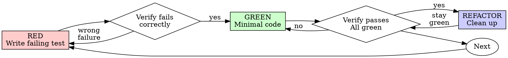

# Test-Driven Development (TDD)

## Overview

Write the test first. Watch it fail. Write minimal code to pass.

**Core principle:** If you didn't watch the test fail, you don't know if it tests the right thing.

**Violating the letter of the rules is violating the spirit of the rules.**

## How to Trigger This Skill

This skill uses **MANUAL TRIGGER** mode. You must explicitly request it using one of these keywords:

### 🎯 Direct TDD Requests
```
"用 TDD 开发用户登录功能"
"测试驱动开发实现订单接口"
"先写测试，后写代码"
```

### 📊 Coverage Check Requests
```
"检查覆盖率"
"测试覆盖率达标了吗？"
"运行覆盖率检查"
"查看代码覆盖率"
```

### ✍️ Test Writing Requests
```
"写测试用例"
"编写单元测试"
"给这个功能加上测试"
"补充测试用例"
```

### 🏆 Quality Requests
```
"确保代码质量"
"需要高质量的测试"
"测试质量要求"
```

**What Happens When Triggered:**
1. ✅ Enforce TDD workflow (Red-Green-Refactor)
2. ✅ Require 95% coverage for core modules (strategy/, risk/, api/)
3. ✅ Require 80% coverage for general modules (utils/, infra/, scripts/)
4. ✅ Update TEST_PROGRESS.md automatically
5. ✅ Block completion if coverage not met

**Important**: This skill will NOT auto-trigger. You must explicitly request testing or TDD.

## Project-Specific Standards

### 🎯 Quantitative Trading Project Rules

This TDD skill enforces **STRICT** testing standards for quantitative trading projects:

#### 1. Dual Coverage Standards (双标)

| Module Tier | Coverage Threshold | Example Directories | Requirements |
|-------------|-------------------|---------------------|--------------|
| **Core (Tier 1)** | **95%** | `src/strategy/`, `src/risk/`, `src/api/` | Must cover ALL if/else branches + exception handling |
| **General (Tier 2)** | **80%** | `src/utils/`, `src/infra/`, `scripts/` | Core logic flows must be 100% covered |

**RED LINE**: AI MUST NOT mark task complete if coverage below threshold.

**Verification Command**:
```bash
npm run test:cov          # Jest/Vitest projects
pytest --cov=src          # Python projects
```

#### 2. Test Progress Tracking

**MANDATORY**: Maintain `TEST_PROGRESS.md` in project root.

Update after EVERY feature completion:

**Status Markers**:
- ✅ = Tested and passed
- ⏳ = Partially tested (edge cases pending)
- ❌ = Failed or not tested

**Required Fields**:
- Module name
- Sub-feature/API
- Test status (✅/⏳/❌)
- Actual coverage percentage
- Test file path
- Notes (e.g., "Mock data construction needed")

**Example Entry**:
```markdown
### 风险控制 (Risk Control)
- [✅] 止损逻辑触发 (98%) - `tests/risk/stop-loss.test.ts`
- [⏳] 极端行情下的滑点模拟 (NA) - 原因：Mock数据构造中
```

#### 3. Task Closure Requirements

Before ending ANY task:

- [ ] Update `TEST_PROGRESS.md`
- [ ] Run coverage check: `npm run test:cov` or `pytest --cov`
- [ ] Verify API docs sync with code
- [ ] Report current core module coverage in response
- [ ] Fix any failing tests

**Exception**: Only skip with human partner's explicit permission.

#### 4. Documentation Splitting Rule

**MAX 1000 lines per document**.

When approaching limit:
- Split by feature (e.g., `API_AUTH.md`, `API_TRADE.md`)
- Update index with links to sub-docs

## When to Use

**Always:**
- New features
- Bug fixes
- Refactoring
- Behavior changes

**Exceptions (ask your human partner):**
- Throwaway prototypes
- Generated code
- Configuration files

Thinking "skip TDD just this once"? Stop. That's rationalization.

## The Iron Law

```
NO PRODUCTION CODE WITHOUT A FAILING TEST FIRST
```

Write code before the test? Delete it. Start over.

**No exceptions:**
- Don't keep it as "reference"
- Don't "adapt" it while writing tests
- Don't look at it
- Delete means delete

Implement fresh from tests. Period.

## Red-Green-Refactor



### RED - Write Failing Test

Write one minimal test showing what should happen.

<Good>
```typescript
test('retries failed operations 3 times', async () => {
  let attempts = 0;
  const operation = () => {
    attempts++;
    if (attempts < 3) throw new Error('fail');
    return 'success';
  };

  const result = await retryOperation(operation);

  expect(result).toBe('success');
  expect(attempts).toBe(3);
});
```
Clear name, tests real behavior, one thing
</Good>

<Bad>
```typescript
test('retry works', async () => {
  const mock = jest.fn()
    .mockRejectedValueOnce(new Error())
    .mockRejectedValueOnce(new Error())
    .mockResolvedValueOnce('success');
  await retryOperation(mock);
  expect(mock).toHaveBeenCalledTimes(3);
});
```
Vague name, tests mock not code
</Bad>

**Requirements:**
- One behavior
- Clear name
- Real code (no mocks unless unavoidable)

### Verify RED - Watch It Fail

**MANDATORY. Never skip.**

```bash
npm test path/to/test.test.ts
```

Confirm:
- Test fails (not errors)
- Failure message is expected
- Fails because feature missing (not typos)

**Test passes?** You're testing existing behavior. Fix test.

**Test errors?** Fix error, re-run until it fails correctly.

### GREEN - Minimal Code

Write simplest code to pass the test.

<Good>
```typescript
async function retryOperation<T>(fn: () => Promise<T>): Promise<T> {
  for (let i = 0; i < 3; i++) {
    try {
      return await fn();
    } catch (e) {
      if (i === 2) throw e;
    }
  }
  throw new Error('unreachable');
}
```
Just enough to pass
</Good>

<Bad>
```typescript
async function retryOperation<T>(
  fn: () => Promise<T>,
  options?: {
    maxRetries?: number;
    backoff?: 'linear' | 'exponential';
    onRetry?: (attempt: number) => void;
  }
): Promise<T> {
  // YAGNI
}
```
Over-engineered
</Bad>

Don't add features, refactor other code, or "improve" beyond the test.

### Verify GREEN - Watch It Pass

**MANDATORY.**

```bash
npm test path/to/test.test.ts
```

Confirm:
- Test passes
- Other tests still pass
- Output pristine (no errors, warnings)

**Test fails?** Fix code, not test.

**Other tests fail?** Fix now.

### REFACTOR - Clean Up

After green only:
- Remove duplication
- Improve names
- Extract helpers

Keep tests green. Don't add behavior.

### Repeat

Next failing test for next feature.

## Good Tests

| Quality | Good | Bad |
|---------|------|-----|
| **Minimal** | One thing. "and" in name? Split it. | `test('validates email and domain and whitespace')` |
| **Clear** | Name describes behavior | `test('test1')` |
| **Shows intent** | Demonstrates desired API | Obscures what code should do |

## Why Order Matters

**"I'll write tests after to verify it works"**

Tests written after code pass immediately. Passing immediately proves nothing:
- Might test wrong thing
- Might test implementation, not behavior
- Might miss edge cases you forgot
- You never saw it catch the bug

Test-first forces you to see the test fail, proving it actually tests something.

**"I already manually tested all the edge cases"**

Manual testing is ad-hoc. You think you tested everything but:
- No record of what you tested
- Can't re-run when code changes
- Easy to forget cases under pressure
- "It worked when I tried it" ≠ comprehensive

Automated tests are systematic. They run the same way every time.

**"Deleting X hours of work is wasteful"**

Sunk cost fallacy. The time is already gone. Your choice now:
- Delete and rewrite with TDD (X more hours, high confidence)
- Keep it and add tests after (30 min, low confidence, likely bugs)

The "waste" is keeping code you can't trust. Working code without real tests is technical debt.

**"TDD is dogmatic, being pragmatic means adapting"**

TDD IS pragmatic:
- Finds bugs before commit (faster than debugging after)
- Prevents regressions (tests catch breaks immediately)
- Documents behavior (tests show how to use code)
- Enables refactoring (change freely, tests catch breaks)

"Pragmatic" shortcuts = debugging in production = slower.

**"Tests after achieve the same goals - it's spirit not ritual"**

No. Tests-after answer "What does this do?" Tests-first answer "What should this do?"

Tests-after are biased by your implementation. You test what you built, not what's required. You verify remembered edge cases, not discovered ones.

Tests-first force edge case discovery before implementing. Tests-after verify you remembered everything (you didn't).

30 minutes of tests after ≠ TDD. You get coverage, lose proof tests work.

## Common Rationalizations

| Excuse | Reality |
|--------|---------|
| "Too simple to test" | Simple code breaks. Test takes 30 seconds. |
| "I'll test after" | Tests passing immediately prove nothing. |
| "Tests after achieve same goals" | Tests-after = "what does this do?" Tests-first = "what should this do?" |
| "Already manually tested" | Ad-hoc ≠ systematic. No record, can't re-run. |
| "Deleting X hours is wasteful" | Sunk cost fallacy. Keeping unverified code is technical debt. |
| "Keep as reference, write tests first" | You'll adapt it. That's testing after. Delete means delete. |
| "Need to explore first" | Fine. Throw away exploration, start with TDD. |
| "Test hard = design unclear" | Listen to test. Hard to test = hard to use. |
| "TDD will slow me down" | TDD faster than debugging. Pragmatic = test-first. |
| "Manual test faster" | Manual doesn't prove edge cases. You'll re-test every change. |
| "Existing code has no tests" | You're improving it. Add tests for existing code. |

## Red Flags - STOP and Start Over

- Code before test
- Test after implementation
- Test passes immediately
- Can't explain why test failed
- Tests added "later"
- Rationalizing "just this once"
- "I already manually tested it"
- "Tests after achieve the same purpose"
- "It's about spirit not ritual"
- "Keep as reference" or "adapt existing code"
- "Already spent X hours, deleting is wasteful"
- "TDD is dogmatic, I'm being pragmatic"
- "This is different because..."

**All of these mean: Delete code. Start over with TDD.**

## Example: Bug Fix

**Bug:** Empty email accepted

**RED**
```typescript
test('rejects empty email', async () => {
  const result = await submitForm({ email: '' });
  expect(result.error).toBe('Email required');
});
```

**Verify RED**
```bash
$ npm test
FAIL: expected 'Email required', got undefined
```

**GREEN**
```typescript
function submitForm(data: FormData) {
  if (!data.email?.trim()) {
    return { error: 'Email required' };
  }
  // ...
}
```

**Verify GREEN**
```bash
$ npm test
PASS
```

**REFACTOR**
Extract validation for multiple fields if needed.

## Coverage Verification

### Before Marking Complete

**MANDATORY CHECKS**:

1. **Run Coverage Report**:
   ```bash
   npm run test:cov          # For TypeScript/JavaScript
   pytest --cov=src --cov-report=term-missing  # For Python
   ```

2. **Verify Thresholds**:
   - Core modules (Tier 1) ≥ 95%
   - General modules (Tier 2) ≥ 80%

3. **Check Specific Files**:
   ```bash
   # Check specific file coverage
   npm run test:cov -- src/strategy/execution.ts
   ```

4. **View Uncovered Lines**:
   ```bash
   # Show missing line numbers
   npm run test:cov -- --coverage --verbose
   ```

**If Below Threshold**:
- ❌ DO NOT mark task complete
- ✅ Add tests for uncovered branches
- ✅ Re-run until达标

### Coverage Report Template

After running tests, report format:

```
=== Coverage Report ===
Core Modules (Tier 1):
  src/strategy/execution.ts:  97% ✅
  src/risk/stop-loss.ts:      94% ⚠️  (Need +1%)
  src/api/order.ts:           96% ✅

General Modules (Tier 2):
  src/utils/date.ts:          85% ✅
  src/infra/database.ts:      78% ⚠️  (Need +2%)

Overall: 92% (Target: 95% for core, 80% for general)
Status: ⏳ Pending improvements in risk/stop-loss.ts
```

## Verification Checklist

Before marking work complete:

- [ ] Every new function/method has a test
- [ ] Watched each test fail before implementing
- [ ] Each test failed for expected reason (feature missing, not typo)
- [ ] Wrote minimal code to pass each test
- [ ] All tests pass
- [ ] Output pristine (no errors, warnings)
- [ ] Tests use real code (mocks only if unavoidable)
- [ ] Edge cases and errors covered
- [ ] **Coverage meets threshold**: Core ≥95%, General ≥80%
- [ ] **TEST_PROGRESS.md updated** with current coverage
- [ ] **API docs synced** with implementation

Can't check all boxes? You skipped TDD. Start over.

## When Stuck

| Problem | Solution |
|---------|----------|
| Don't know how to test | Write wished-for API. Write assertion first. Ask your human partner. |
| Test too complicated | Design too complicated. Simplify interface. |
| Must mock everything | Code too coupled. Use dependency injection. |
| Test setup huge | Extract helpers. Still complex? Simplify design. |

## Debugging Integration

Bug found? Write failing test reproducing it. Follow TDD cycle. Test proves fix and prevents regression.

Never fix bugs without a test.

## Testing Anti-Patterns

When adding mocks or test utilities, read @testing-anti-patterns.md to avoid common pitfalls:
- Testing mock behavior instead of real behavior
- Adding test-only methods to production classes
- Mocking without understanding dependencies

## Final Rule

```
Production code → test exists and failed first
Otherwise → not TDD
```

No exceptions without your human partner's permission.

---

## Test Progress Documentation

### TEST_PROGRESS.md Template

Create `TEST_PROGRESS.md` in project root:

```markdown
# 测试进度跟踪 (Test Progress Tracking)

> **更新时间**: 2026-01-21
> **覆盖率目标**: 核心模块 95% | 通用模块 80%

---

## 📊 整体覆盖率概览

| 模块类型 | 当前覆盖率 | 目标覆盖率 | 状态 |
|---------|-----------|-----------|------|
| 核心模块 (Tier 1) | -- | 95% | ⏳ |
| 通用模块 (Tier 2) | -- | 80% | ⏳ |
| **整体项目** | -- | 90% | ⏳ |

---

## 🎯 核心模块 (Tier 1) - 目标: 95%

### 策略执行 (Strategy Execution)

| 功能 | 测试状态 | 覆盖率 | 测试文件 | 备注 |
|------|---------|--------|---------|------|
| 订单下单接口 | ✅ 已完成 | -- | `tests/order.test.ts` | 涵盖市价/限价单 |
| 订单撤单逻辑 | ⏳ 待测试 | -- | - | 需处理网络延迟 |
| 订单状态查询 | ❌ 未测试 | -- | - | - |

**当前模块覆盖率**: -- %

### 风险控制 (Risk Control)

| 功能 | 测试状态 | 覆盖率 | 测试文件 | 备注 |
|------|---------|--------|---------|------|
| 止损逻辑触发 | ⏳ 部分完成 | -- | `tests/risk/stop-loss.test.ts` | 边界条件未覆盖 |
| 持仓限额检查 | ❌ 未测试 | -- | - | - |
| 极端行情处理 | ❌ 未测试 | -- | - | 需构造模拟数据 |

**当前模块覆盖率**: -- %

### API 接口 (API Layer)

| 功能 | 测试状态 | 覆盖率 | 测试文件 | 备注 |
|------|---------|--------|---------|------|
| 用户认证 | ❌ 未测试 | -- | - | - |
| 订单管理 | ❌ 未测试 | -- | - | - |

**当前模块覆盖率**: -- %

---

## 🔧 通用模块 (Tier 2) - 目标: 80%

### 数据处理 (Data Processing)

| 功能 | 测试状态 | 覆盖率 | 测试文件 | 备注 |
|------|---------|--------|---------|------|
| K线数据清洗 | ❌ 未测试 | -- | - | 需处理空值 |
| 数据格式转换 | ❌ 未测试 | -- | - | - |

**当前模块覆盖率**: -- %

### 基础设施 (Infrastructure)

| 功能 | 测试状态 | 覆盖率 | 测试文件 | 备注 |
|------|---------|--------|---------|------|
| 数据库连接 | ❌ 未测试 | -- | - | - |
| 日志系统 | ❌ 未测试 | -- | - | - |

**当前模块覆盖率**: -- %

---

## 🚨 待修复问题

| 优先级 | 问题描述 | 影响模块 | 负责人 | 截止日期 |
|-------|---------|---------|--------|---------|
| P0 | 止损逻辑边界条件覆盖不足 | risk/stop-loss | - | - |

---

## 📝 更新日志

- **2026-01-21**: 创建测试进度跟踪文档

---

**图例说明**:
- ✅ = 已完成测试并通过
- ⏳ = 部分完成或进行中
- ❌ = 未测试或测试失败
- -- = 待测量
```

### How to Use

1. **After Each Feature**:
   ```bash
   npm run test:cov
   # Copy coverage % to relevant section
   # Update test status (✅/⏳/❌)
   ```

2. **Before Task Complete**:
   - Verify all Tier 1 modules ≥ 95%
   - Verify all Tier 2 modules ≥ 80%
   - Update "整体覆盖率概览" table

3. **Weekly Review**:
   - Check "待修复问题" section
   - Prioritize modules below threshold

### AI Auto-Update Command

When AI completes feature, auto-execute:

```bash
# Update TEST_PROGRESS.md
npm run test:cov | tee coverage_report.txt
# Parse and update markdown
```

---

**END OF SKILL DOCUMENTATION**
